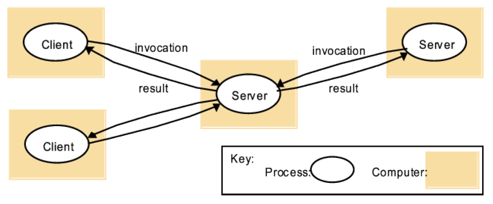
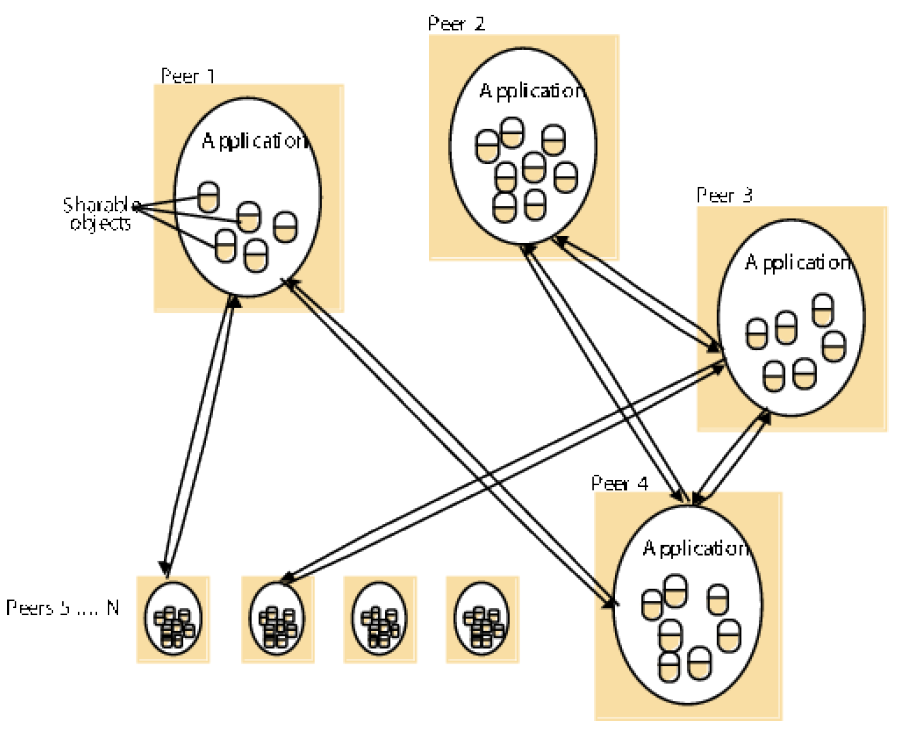
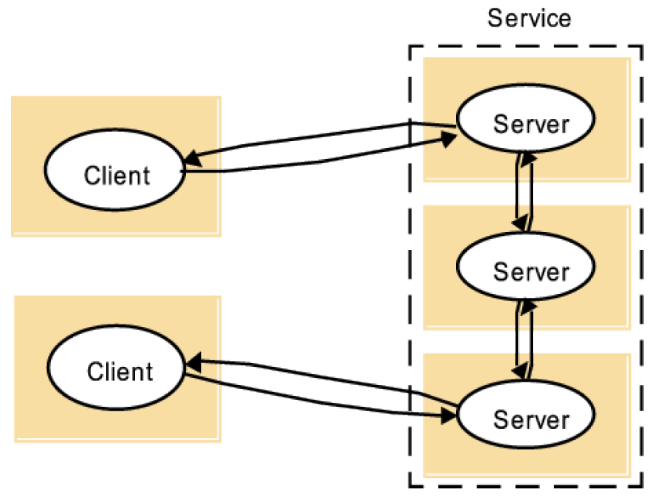
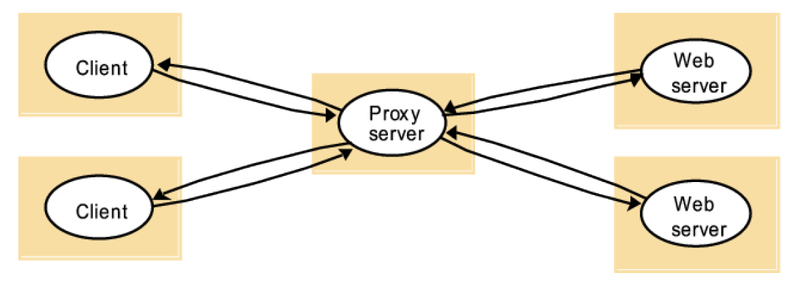
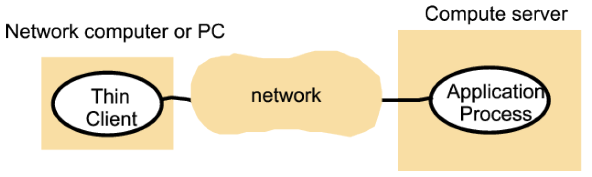

# COMP90015 Distributed System
## Final Exam
### Semester 1, 2017
_ _ _
Wriiten by Yixiong Ding  
The University of Melbourne  
October, 2018  
_ _ _

#### Q.1. (a) [5 marks] Consider a non-distributed application that allows a user to conduct a long-running simulation, with the ability to monitor and control the simulation using a graphical user (GUI) interface. The GUI interface displays a large number of simulation outputs in real-time. Now consider the same application that has been split into two processes: a server process that runs the simulation, and a GUI process that allows user monitoring and control. This is now a distributed application. Give three reasons for and two reasons against the use of a distributed application with respect to this example. Make sure your reasons are all distinctly different.

#### Answer
**This can be considered as the pros of distributed system**

For:
- The simulation can be accessed remotely.
- Multiple users can access the same simulation at the same time.
- The GUI can be recompiled without having to stop the simulation.

**This can be considered as the cons of distributed system**

Against:
- Bandwidth between GUI and simulation can be a limiting factor.
- Application becomes more complicated to build.

#### (b) [5 marks] Explain what is meant by eventual consistency in a distributed system. You may give an example application to aid your answer. Give your reasons for and against adopting eventual consistency in a distributed system.

#### Answer:
Eventual consistency in a distributed systems means that, assuming there are no changes to data/state, the state of the system is eventually seen as the same no matter from where data is accessed. For example, a change to some data in a distributed database may take some time to propogate to all nodes. Before it has done so, some reads at some nodes may be inconsistent. But evetually the system will become consistent. It is good for providing large scale systems because it tolerates latency and faults. However some applications may require absolute consistency such as banking applications. Eventual consistency as well needs further definition as to what kinds of inconsistent states that nodes can "see".

#### Q.2. [5 marks] For each of the following architectural designs, provide a definition and give a reason for and a reason against the use of the design. Draw a diagram to illustrate the architecture.

##### (a) Client/Server
Client/server has many clients processes connecting to a single server process. Clients invoke services in servers and results are returned. Servers in turn can become clients to other services. The clients never connect to each other. It is a simple design and easy to understand/implement. However the server can easily become a bottleneck to scalability.
 

##### (b) Peer-to-Peer
Peer-to-Peer allows all peer processes to connect to each other. Each process in the systems plays a similar role interacting cooperatively as peers (playing the roles of client and server simultaneously). The failure of any given peer is no worse than other peer. Peer-to-Peer provides scalability but it leads to IP addresses being revealed which is a security concern.
 

##### (c) Multi-server
Multi-server is like Client/server however there are multi-servers to which a client may connect. The multi-servers typically communicate with each other or with a data storage tier. Objects may be partitioned (e.g web servers) or replicated across servers (e.g. Sun Network Information Service (NIS)). Multi-server provides for greater scalability than Client/server but it adds latency to the client requests, since multiple servers may need to be involved with a single request. It also is more complex than Client/server.
 

##### (d) Proxy server
A Proxy server architecture has a proxy process, which typically sits between a client and a server. The client's requests to the server are instead sent to the proxy and the proxy forwards them on the server. Responses from the server go to the proxy which forwards them back to the client. The proxy is typically transparent to the client/server protocol. It is good for providing monitoring of client/server requests (e.g. to obtain statistics) but it adds more latency and may become a bottleneck.
 

##### (e) Thin-client
A thin client architecture runs the entire application on the server and uses the client only for user I/O and control. The client does not install any applications. This makes managing the client easy but it means more network bandwidth and latency requirements which may cause some applications to be ineffective (such as video editing).
 

#### Q.3. [5 marks] In the first project, a minimum connection time interval was used, whereby connections from a given IP address were only allowed to continue if there had been no connection within the last connection time interval. What purpose does this serve? What drawbacks or weaknesses does it have? Is there a better way to achieve the same functionality? If yes, explain, if no give a reason.

#### Answer:
The connection time interval served the purposes of trying to prevent a single client (more specifically a single IP address) being able to flood the server with spurious requests, e.g. creating huge numbers of files and exhausting memory. It does have the draw back that legitimate requests may be throttled, including requests from other servers that are query relays. The same functionality could be pushed to the network layer, e.g. handled at the router, and this be more effective at preventing the server from becomming overloaded.

#### Q.4. (a) [5 marks] Suppose that a client creates a TCP Socket to a server, sends a command, and waits for a response. However the server has failed internally and does not respond, though the connection remains open. What can be done by the client to overcome this? Critically explain your answer and include discussion concerning relevant distributed system challenges.

#### Answer:
The client can use a socket timeout that will timeout with an exception if there is no activity on the socket. This allows the client to decide if it wants to connect again (try again) or not. The challenge is doing this transparently and with performance in mind. Eventually the timeout condition and retries may fail and need to be reported to the user. As well there is the question of how long should be given before timeout: too short and maybe the timeout will be premature while too long and time will be wasted (the user is waiting). 

#### (b) [5 marks] Explain what is meant by a remote procedure call or RPC. Discuss the aspects of implementing an RPC middleware such as Sun RPC. Draw a diagram to show the architectural components of the implementation.

#### Answer:
A remote procedure call (RPC) allows one process to call a procedure in another process, giving it some arguments and obtaining the returned value. RPC is typically access transparent. An RPC like Sun RPC requires the programmer to define the interface of the remote procedures using a interface definition language(idl). Compiling the idl gives rise to definitions that the server must implement and that the client uses to access the remote procedures. The client process creates a connection to the server process and then it can call the remote procedure stub processes using the connection. The arguments are marshalled, transmitted, unmarshalled, executed, the return argument is marshalled, transmitted and unmarshalled and returned to the calling procedure.

#### Q.5. (a) [5 marks] What are the differences between the message queue paradigm and the publish/subscribe paradigm? Give an example application where the message queue paradigm would be the more appropriate choice over publish/subscribe and say why

#### Answer:
 A message queue paradigm consists of a queue: senders put messages on the queue and receivers take messages from the head of the queue. Once the message has been taken from the queue by a receiver, it is not available to other receivers. On the other hand, publish/subscribe has a log of messages (events), whereby all receivers (subscribers) for a given topic (queue) will receive every event that is published to that topic. Publish/subscribe systems may keep a past log for some time, while message queue systems do not keep messages that have been taken from the queue. The message queue paradigm is most appropriate when communication is specifically one-to-one or one-to-many where each message must be consumed by exactly one receiver, e.g. a job distribution system that distributes jobs to workers. Having said this, some publish/subscribe implementations provide paritioning that also achieves this.

 #### (b) [5 marks]What is meant by the term overlay network in distributed systems? What is a benefit of using an overlay network?

 #### Answer:
 An overlay network is a network of application processes that run on the network edge, whereby communication takes place between the application processes typically using some kind of routing protocol or lookup protocol. An overlay network can allow the application to optimize its communication at large scale, e.g. in a peer-to-peer fashion, in applications like video streaming where a broadcast tree is useful. Internet-wide video on demand is example application where an overlay network can be effective.
 