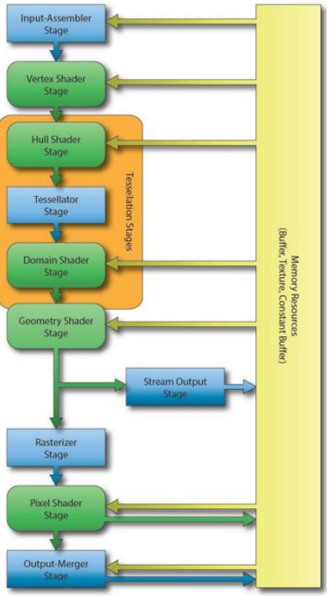
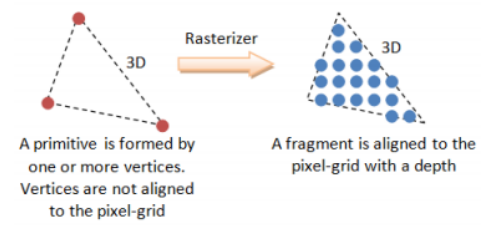
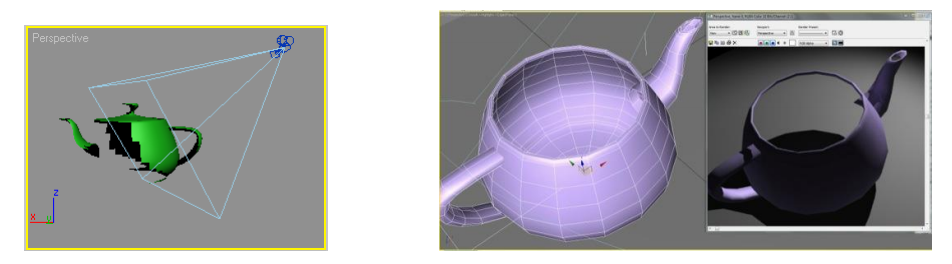
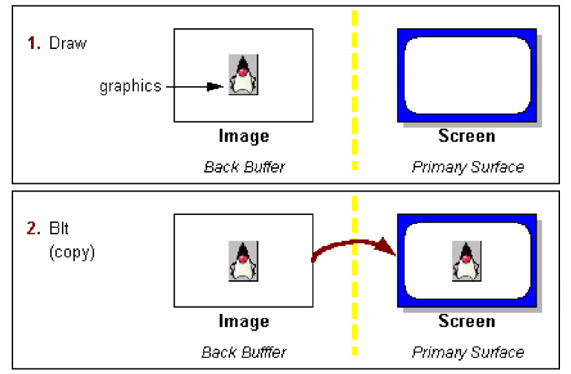

# Graphcis and Interaction Notes

Summary is wriiten by Yixiong Ding  
The University of Melbourne  
November, 2019   
_ _ _

## Lecture 1: Introduction

### Subject Aim

- Understand common operation in computer graphics and the basic properties of light and colour, and
- Understand the principles of interaction, and how to develop and evaluate 3D applications

### What is CG and Interaction?

- **Computer graphics (CG)**: refers to anything involved in the creation or manipulation of images on a computer, including animated images
    - Applications include computer games, computer aided design, simulation, virtual and augmented reality and visualisation and forms the basis of all graphical user interfaces

- **Interaction**:  concerns the study of how humans use interactive computing systems. Important for applications of computer graphics that are used directly by humans
    - This includes graphical user interfaces, input mechanisms (e.g., touch), elements of human cognition

### Available Tools

- 3DS Max
- Blender
- Maya
- **Unity**
  - Unity3D is a powerful cross-platform 3D engine and a user friendly development environment. Easy to grasp to beginners, but at the same time powerful enough for experts. Enables user to easily create 3D games and applications

- - -
## Lecture 3: Pipeline Rendering
- - -

### Graphics Programming

- Game engines, and other graphics programs, generally use either Direct3D (Windows) or OpenGL (most other platforms)
- Modern PC graphics cards will support some version of both APIs
- Game engines (like Unity) build upon these APIs to make development easier

### Representing Objects

- For efficiency, the graphics card will render objects as triangles
- Any polyhedron can be represented by triangles
- Other 3D shapes can be approximated by triangles

### Pipelining

- Both OpenGL and Direct3D operate a pipeline, consisting of several different stages
- This allows the programmer to perform a number of different operations on the input data, and provides greater efficiency
- There are some differences between the OpenGL and Direct3D pipelines
- We will focus mainly on Direct3D pipeline

#### Input Assembler
 
- Building block stage
- Reads data from our buffers into a primitive format that can be used by the other stages of the pipeline
- We mainly use Triangle Lists

#### Vertex Shader

- Performs operations on individual vertices received from the Input Assembler stage
- This will typically include transformations (translation, rotation, scale)
- May also include per-vertex lighting

#### Tesselation Stages

- Optional Stages, added with Direct3D 11
- These stages allow us to generate additional vertices within the **GPU** 
- Can take a lower detail model and render in higher detail
- Can perform level of detail scaling

#### Geometry Shader

- Optional Stage, added with Direct3D 10
- Operates on an entire primitive (e.g. triangle)
- Can perform a number of algorithms, e.g. dynamically calculating normals, particle systems, shadow volume generation

#### Stream Output Stage

- Pointing back to the buffer because we want to do more operations
- Allows us to receive data (vertices or primitives) from the geometry shader and feed back into pipeline for processing by another set of shaders
- This can be used to have the GPU do processing that would otherwise have been done on the CPU
- Useful e.g. for particle systems update (waves, ripples)

#### Rasterizer Stage

- Converts vector information (composed of shapes or primitives) into a raster image (composed of pixels) for the purpose of displaying real-time 3D graphics

- Performs culling

##### Culling

- In order to avoid rendering vertices that will not be displayed in the final image, DirectX performs ¡®culling¡¯
- Triangles facing away from the camera will be culled and not rendered
- Triangles with vertices in a counterclockwise order are not rendered 
- The order of vertices is therefore important
- DirectX performs ¡®Counter-Clockwise culling¡¯ 
- Triangles with vertices in a counterclockwise order are not rendered 
- The order of vertices is therefore important
- You can create an algorithm that as you rotate the object it changes dynamically the order you are creating the triangles to either make them render or not render

#### Pixel (Fragment) Shader

- Produces colour values for each interpolated pixel fragment
- Per-pixel lighting can be performed
- Can also produce depth values for depth-buffering

#### Output-Merger Stage

- Combines pixel shader output values to produce final image
- May also perform depth buffering
- Double buffering

##### Double Buffering

- Don¡¯t want to draw objects directly to the screen!
- The screen could update before a new frame has been completely drawn
- Instead draw next frame to a buffer and swap buffers when complete
- In game, image lagging happens because the buffer is full 

##### Framerate
 
- Data sent through the pipeline X amount of times per second
- If X is 30, then the framerate is 30fps

