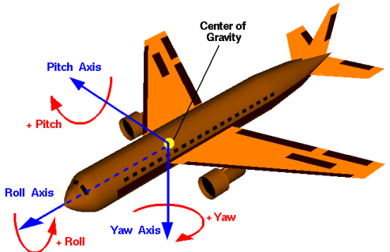
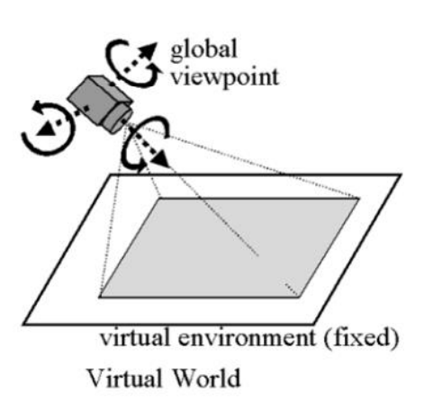
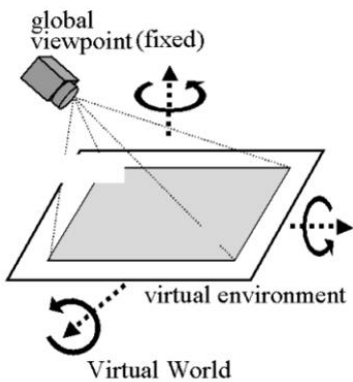
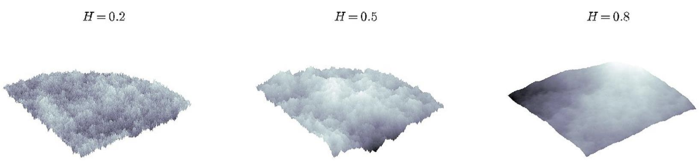
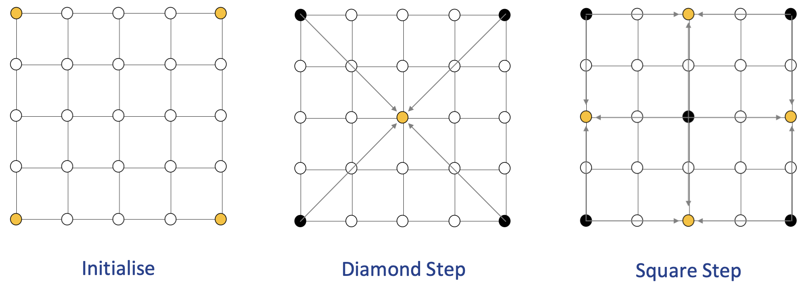
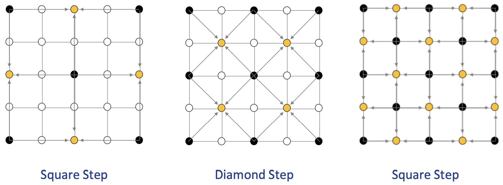

# Graphcis and Interaction Notes

Summary is wriiten by Yixiong Ding  
The University of Melbourne  
November, 2019   
_ _ _

## Lecture 1: Introduction

### Subject Aim

- Understand common operation in computer graphics and the basic properties of light and colour, and
- Understand the principles of interaction, and how to develop and evaluate 3D applications

### What is CG and Interaction?

- **Computer graphics (CG)**: refers to anything involved in the creation or manipulation of images on a computer, including animated images
    - Applications include computer games, computer aided design, simulation, virtual and augmented reality and visualisation and forms the basis of all graphical user interfaces

- **Interaction**:  concerns the study of how humans use interactive computing systems. Important for applications of computer graphics that are used directly by humans
    - This includes graphical user interfaces, input mechanisms (e.g., touch), elements of human cognition

### Available Tools

- 3DS Max
- Blender
- Maya
- **Unity**
  - Unity3D is a powerful cross-platform 3D engine and a user friendly development environment. Easy to grasp to beginners, but at the same time powerful enough for experts. Enables user to easily create 3D games and applications

- - -
## Lecture 3: Pipeline Rendering
- - -

### Graphics Programming

- Game engines, and other graphics programs, generally use either Direct3D (Windows) or OpenGL (most other platforms)
- Modern PC graphics cards will support some version of both APIs
- Game engines (like Unity) build upon these APIs to make development easier

### Representing Objects

- For efficiency, the graphics card will render objects as triangles
- Any polyhedron can be represented by triangles
- Other 3D shapes can be approximated by triangles

### Pipelining

- Both OpenGL and Direct3D operate a pipeline, consisting of several different stages
- This allows the programmer to perform a number of different operations on the input data, and provides greater efficiency
- There are some differences between the OpenGL and Direct3D pipelines
- We will focus mainly on Direct3D pipeline

#### Input Assembler
 
- Building block stage
- Reads data from our buffers into a primitive format that can be used by the other stages of the pipeline
- We mainly use Triangle Lists

#### Vertex Shader

- Performs operations on individual vertices received from the Input Assembler stage
- This will typically include transformations (translation, rotation, scale)
- May also include per-vertex lighting

#### Tesselation Stages

- Optional Stages, added with Direct3D 11
- These stages allow us to generate additional vertices within the **GPU** 
- Can take a lower detail model and render in higher detail
- Can perform level of detail scaling

#### Geometry Shader

- Optional Stage, added with Direct3D 10
- Operates on an entire primitive (e.g. triangle)
- Can perform a number of algorithms, e.g. dynamically calculating normals, particle systems, shadow volume generation

#### Stream Output Stage

- Pointing back to the buffer because we want to do more operations
- Allows us to receive data (vertices or primitives) from the geometry shader and feed back into pipeline for processing by another set of shaders
- This can be used to have the GPU do processing that would otherwise have been done on the CPU
- Useful e.g. for particle systems update (waves, ripples)

#### Rasterizer Stage

- Converts vector information (composed of shapes or primitives) into a raster image (composed of pixels) for the purpose of displaying real-time 3D graphics

- Performs culling

##### Culling

- In order to avoid rendering vertices that will not be displayed in the final image, DirectX performs ''culling''
- Triangles facing away from the camera will be culled and not rendered
- Triangles with vertices in a counterclockwise order are not rendered 
- The order of vertices is therefore important
- DirectX performs ''Counter-Clockwise culling'' 
- Triangles with vertices in a counterclockwise order are not rendered 
- The order of vertices is therefore important
- You can create an algorithm that as you rotate the object it changes dynamically the order you are creating the triangles to either make them render or not render

#### Pixel (Fragment) Shader

- Produces colour values for each interpolated pixel fragment
- Per-pixel lighting can be performed
- Can also produce depth values for depth-buffering

#### Output-Merger Stage

- Combines pixel shader output values to produce final image
- May also perform depth buffering
- Double buffering

##### Double Buffering

- Don't want to draw objects directly to the screen!
- The screen could update before a new frame has been completely drawn
- Instead draw next frame to a buffer and swap buffers when complete
- In game, image lagging happens because the buffer is full 

##### Framerate
 
- Data sent through the pipeline X amount of times per second
- If X is 30, then the framerate is 30fps

- - -
## Lecture 4: Camera Control
- - -
1. Camera parameters
    - Roll, pitch, yaw, zoom, focal length.
2. Camera control dependency
    - approaches: user and automatic
    - application domain: 3D models, visualisation, games, etc.
    - nature of the user: goals, expertise, etc
3. Navigation metaphors
    - Eyeball in hand, world in hand, flying vehicle, walking

- Camera control is a requirement in nearly all interactive 3D applications
- Including but not limited to: visualisations, games, visual analytics, cinematography, etc
- It is crucial to have effective camera control via positioning and movement

### Camera parameters

- **Roll** - Rotation around the front-to-back axis
- **Pitch** - Rotation around the side-to-side axis
- **Yaw** - Rotation around the vertical axis

- **Focal length**: Approximates behavior of real camera lens. Objects at distance of focal length are in focus; other objects get blurred. Also affects field of view.
- **Zoom**: 
  - When referring to an image or graphic, zoom describes the function of focusing on a section of an image and increasing its overall size to manipulate or view in greater detail
  - As you zoom into an image each of the pixels that make up the image grow and make the image appear pixelated or jaggy
  - Unfortunately, unlike the movies you cannot "enhance" the image to make a zoomed image clearer

### Camera control dependency

Camera control dependent on:
- Balance of camera control approaches
- Application domain
- Nature of the user (goals, expertise, etc.)

### Camera control approaches

- The user exercises interactive control
- The user exercises some degree of interactive control
- The application itself assumes full control of the camera itself

#### User camera control

Interactive approaches propose a set of mappings between the dimensions of the user input device (e.g. mouse, keyboard) and the camera parameters

#### Automatic camera control

The application itself takes care of camera control, either based on user preferences (some degree of control) or predefined heuristics set during implementation

### Application Domain

Camera control will depend on the application domain, such as:
- 3D Modellers
- Visualisation
- Games
- Multimodal systems

### Visualisation

- Visualization is an application for which the user requires interactive control to explore and pursue hypotheses concerning the data
- Restricted to a small number of navigational idioms, for example, the identification of a number of interesting points or regions in the data, and the exploration of the remaining data in relation to these
- Automatic camera control and assisted direct camera control, has the potential to greatly enhance interaction with large data sets

### Games

- Interactive computer games impose the necessity for real-time camera control. The enforcement of frame coherency (smooth changes in camera location and orientation) is necessary to avoid disorienting players
- Games are inherently different from film in that the camera is usually either directly or indirectly controlled by players (typically through their control of characters to which a camera is associated)
- Narrative aspects of real-time games can be supported by the appropriate choice of shot edits both during and between periods of actual game play
- A potential camera control problem involves following one or more characters whilst simultaneously avoiding occlusions in a highly cluttered environment

### Games: Types of viewpoints

#### First person 

- Users control the camera (giving them a sense of being the character in virtual environment). Many games use first person camera views, and the most common genre is the First Person Shooter (FPS), for example, Counter-Strike or Overwatch
- Camera control is unproblematic, since it is directly mapped to the location and orientation of the character

#### Third person 

- The camera system tracks characters from a distance, generally the view is slightly above and behind the main character) and responds to both local elements of the environment (to avoid occlusion) and the character's interactions (maintaining points of interest in shot)

#### Action replay 
- Replays are widely used in modern racing or multi\character games where there are significant events that a player might like to review 
- It is imperative that these replays are meaningful to the players, such that the elements of the scene and their spatial configuration are readily identifiable
- nteractive storytelling presents a number of interesting opportunities for camera control

### Navigation metaphors

#### Eyeball in hand

- The user can manipulate the viewpoint as if it was held in his or her hand, as the mouse is moved
- In essence, the user imagines moving him/herself around the object
- Certain views from far above or below cannot be achieved or are blocked by other objects

#### World in hand

- Connects user's navigation directly to the object or environment to be moved
- The user can imagine that the object is in his/her hand as the mouse is moved
- Useful in a single object case (e.g., cube), but not very good in navigating a virtual environment

#### Flying vehicle

- The camera be treated as a control stick for an airplane
- Makes it easy for a user to get around in 3D space in a relatively unconstrained way

#### Walking

- Allow inhabitants of a virtual environment to navigate by simply allowing them to walk
- The camera moves in the environment while maintaining a constant distance (height) from a ground plane

### Combining navigation metaphors

Applications tend to use multiple metaphors in sequence:

- **flying vehicle** for navigation of a large landscape,
- **world in hand** for proximal inspection, and
- **walking** to give a visitor the sense of presence in an architectural space).

There needs to be smooth transitions between them

- - -
## Lecture 5: Fractal Geometry and Landscapes
- - -

### Fractal

- Originally coined by mathematician Benoit Mandelbrot, and is derived from the Latin word fractus (broken)
- A fractal is a geometric shape is generated using a series of recursive rules
- This means they have a pattern that repeats at different scales, property known as ***self-similarity***

#### Self-Similarity

There are three types of self-similarity found in fractals:
- **Exact self-similarity (strongest)**: The fractal appears identical at different scales. Fractals defined by iterated function systems often display exact self-similarity
- **Quasi-self-similarity**: The fractal appears approximately (but not exactly) identical at different scales. Quasi-self-similar fractals contain small copies of the entire fractal in distorted and degenerate forms
- **Statistical self-similarity (weakest)**: The fractal has numerical or statistical measures which are preserved across scales. Random fractals (e.g., fractal landscapes) are examples of fractals which are statistically self-similar, but neither exactly nor quasi-self-similar

#### In Computer Graphics

- Complex pictures generated by formula and using several iterations. This means one formula is repeated with slightly different values over and over again, taking into account the results from the previous iteration
- Possible to create realistic textured landscapes, such as mountain ranges, coastlines or even destruction patterns
- The typical basic primitives of computer graphics, such as lines, circles, polygons are not suitable for fractals
- This is because you would need millions of these for an acceptable resolution
- Special tailoring of algorithms for rendering fractals is required

### Brownian Motion

Fractional Brownian surfaces for different values of the **Hurst parameter**. The larger the parameter, the smoother the surface

### Diamond Square Algorithm

1. Start by setting the initial values for the corner points of the grid
2. Perform a diamond step and a square step alternately until completion
    - **Diamond step**: For each square in the array, set the midpoint of that square to be the average of the intersecting points plus a random value
    - **Square step**: For each diamond in the array, set the midpoint of that diamond to be the average of the intersecting points plus a random value

- - -
