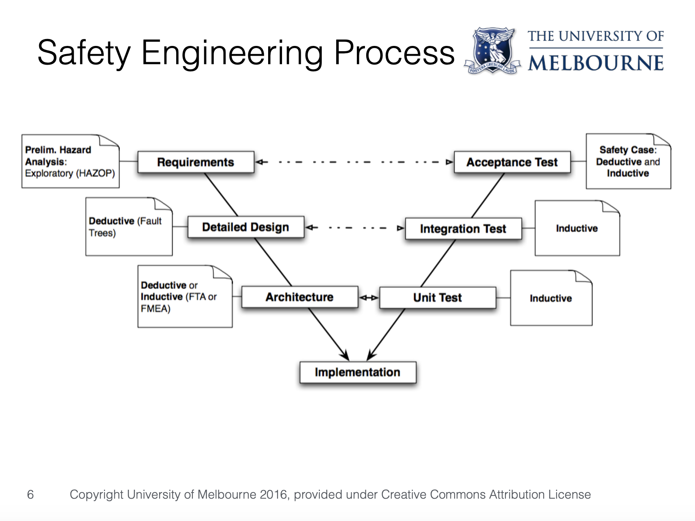
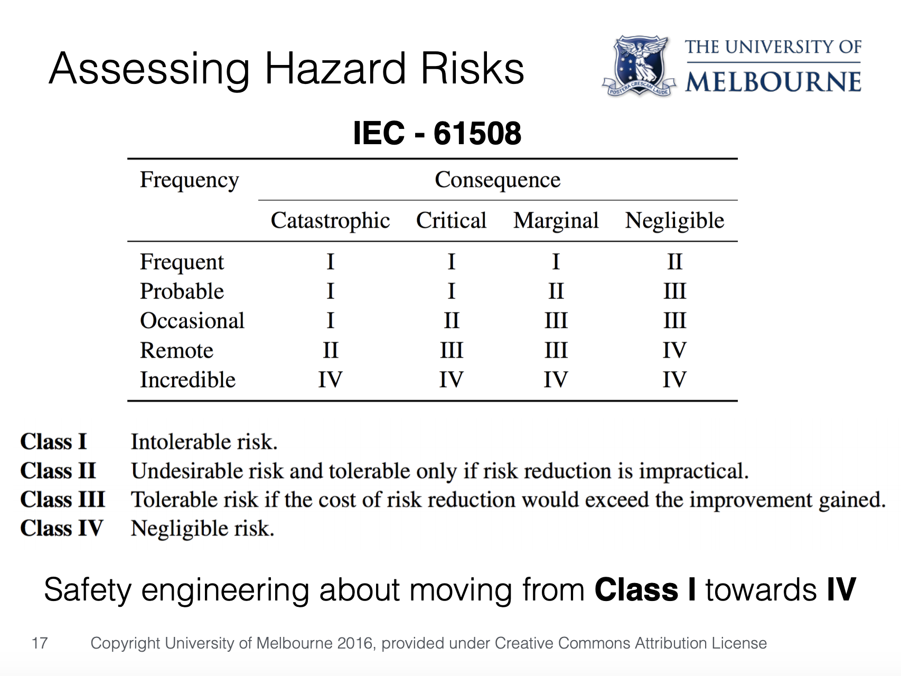

# High Integrity Systems Engineering Notes

Summary is wriiten by Yixiong Ding  
The University of Melbourne  
June, 2019   
_ _ _

## Chapter 1 - An Introduction to HISE
- Lecture 7 High Integrity Systems and Safety Case Studies
    - March 28, 2019 3:20pm-4:15pm

### Learning outcomes
1. Define the term “high-integrity system”
2. Define the different classes of high-integrity system

### What is HISE? How are these different from ordinary software systems?

1. "must work right the first time"
2. Ones in which failure has unacceptable consequences
    - loss of life
    - loss of money

### Safety Critical Systems
- Railway Signalling

### Finance Critical Systems
- High-Frequency Trading Software
- Stock Exchange
- Banking

### Mission Critical
- NASA

### Commercial Formal Methods - Altran galois
1. Crypto and Security Design / Building Blocks
2. Safety/Security Analysis
3. Design Modelling and Analysis (Alloy)
4. Ada
5. Proof (Hoare Logic) & Safe Languages (SPARK)
6. Fault Tolerant Design

## Chapter 2 — Ada
### Learning outcomes
1. Describe the features of Ada that make it suitable for high-integrity software
2. Read and modify basic Ada programs

## Chapter 3 — Safety engineering
- Lecture 7 High Integrity Systems and Safety Case Studies
    - March 28, 2019 3:20pm-4:15pm
- Lecture 8 Safety Engineering, HAZOP, Fault Tree Analysis Security Engineering: Threat Modelling  
    - March 29, 2019 1:05pm-2:00pm

### Learning outcomes
1. Explain the role of safety engineering in the system engineering lifecycle.
2. Discuss the role of accidents and incidents in the safety analysis process
3. Perform a preliminary hazard analsyis using the HAZOP method
4. Apply the fault-tree analysis method to a system for a given fault

### What is Safety
1. Software and hardware used under correct operating conditions don’t cause unacceptable harm to people or environment
    - How we define and quantify unacceptability is a big part of safety engineering
2. Safety cannot be talked about without considering the entire system

### Safety Engineering Processing

### Hazard
1. Things that could lead to (future) accidents
2. Safety engineers examine past accidents etc. looking for **hazards**, Then design the system to be safe in the face of these things, reducing the chance of accidents happening. Doing it properly requires determining **causation**

### Causality
1. Not correlation
2. Often contested, not always clear cut
3. Determined by **counterfactual** reasoning
    - A counterfactual: “if A hadn’t happened, what would be the case …”
    - “A is a cause of B when, if A hadn’t happened, B wouldn’t have happened.

### Safety Engineering Tasks
1. Preliminary Hazard Analysis - **HAZOP**
    1. Based on requirements and early design: “what could go wrong?”
    2. Hazard brainstorming
2. Design - **Fault-Tree Analysis / Formal Specification**
    1. Given those hazards, design the system to eliminate or mitigate them (depending on their risk)
3. Implementation - **Program Verification**
    1. Was it done right?

### HAZOP: HAZARDS AND OPERABILITY STUDY
1. A method for Preliminary Hazard Analysis
2. Exploratory analysis, **systematically** brainstorming what could go wrong

### HAZOP Overview
1. **Input**: high-level system description as a collection of design items
2. **Design item**: an intended behaviour, e.g. an event in a process or a state transition
    - “when sensor X is triggered, valve B is closed immediately”
3. Each design item is systematically **mutated** to analyse what could happen when the intended behaviour doesn’t occur, and to determine the **risk** (consequences and frequency)

 Risk = Consequence x Frequency

 ### HAZOP Summary
 Overall Process
 1. Identify design items
 2. For each, do each guideword:
    1. causes
    2. consequences
    3. safeguards
    4. risk
    5. (design) recommendations

### FAULT TREE ANALYSIS
1. Does my system’s design properly mitigate the hazards identified during PHA (e.g. HAZOP)?
2. Analyses when and how hazards can happen, in the context of the system’s design
3. Is **deductive**, working **backwards** from hazards (or events that lead to them) to how they can be caused

### Analysis Outcomes
**Uses of fault-tree analysis:**
1. to work out whether/how to change design to guard against causes
2. to determine causes that the design doesn’t guard against
3. documentation for safety case
4. allow others to check our reasoning
5. calculate probabilities of hazards arising
