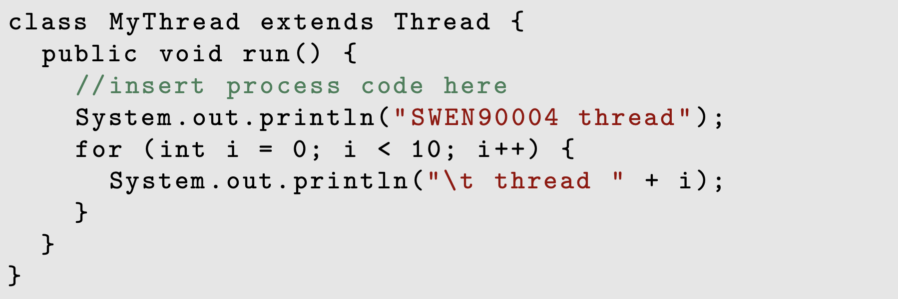
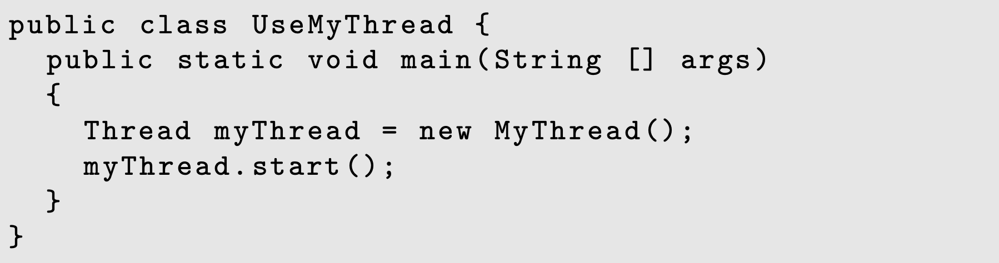
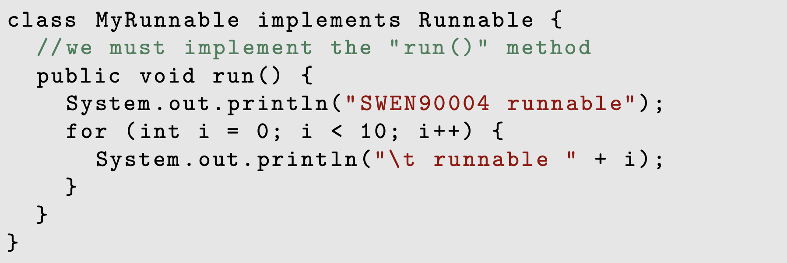
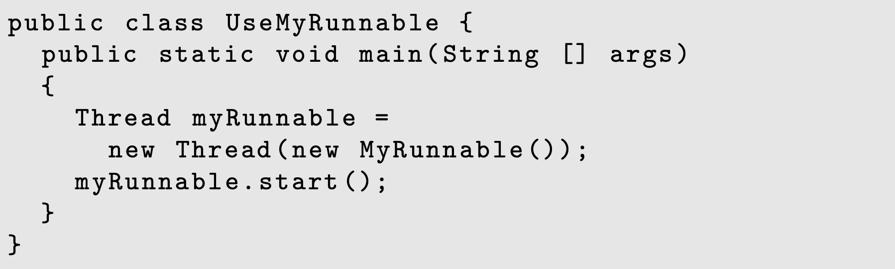
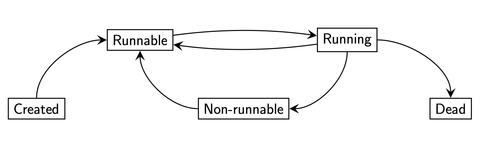
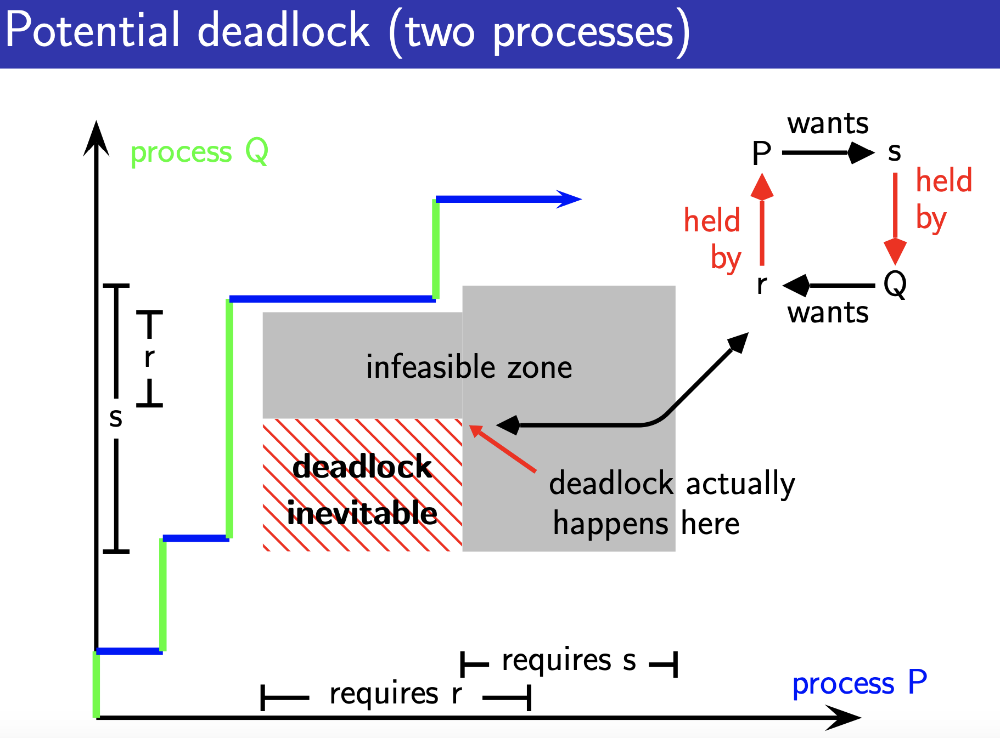
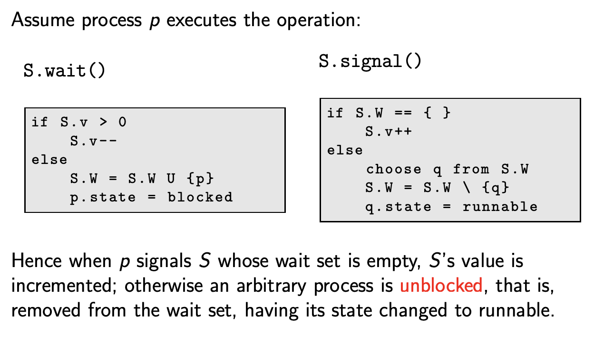

# Modelling Complex Software Systems Notes

Summary is wriiten by Yixiong Ding  
The University of Melbourne  
June, 2019   
_ _ _

## 1. Concurrency
- Lecture Con.01 -- Introduction to Concurrency
    - March 6, 2019 12:05pm-1:00pm
    - March 8, 2019 3:20pm-4:15pm

### Concurrent Program
1. Sequential program:
    - has a single thread of control, that is, a single instruction pointer suffices to manage its execution
2. Concurrent program:
    - allows multiple threads of control.
    - each thread, or process, in a concurrent program often either shares data or communicates with one or more other threads in that program

### Parallelism vs concurrency
1. A program written in a concurrent programming language may be executed with or without actual parallelism; on a single processor typically by time-sharing.
2. Conversely, a program written in a sequential programming language may be executed with parallelism; for example, via vectorization

### Why Concurrency
1. A natural model
2. Necessity
3. Performance

### Concurrent programming is hard
1. **Communication**: Processes generally need to communicate with each other, either by accessing shared data, or by message passing
2. **Synchronization**: Processes may need to synchronize certain events, such as “P must not reach point p until after Q has reached point q.”

### Non-determinism
1. A major source of frustration is the fact that the execution of a concurrent program is non-deterministic
2. Unlike sequential programs, a concurrent program may be **speed-dependent** — its behaviour may depend on the relative speeds of its components’ execution
3. Small, random fluctuations in processor or input-output speed are sources of observed non-determinism

### Concurrent programming language paradigms
1. Shared-memory: assignment 1a
    - Utilising the concept of monitors
    - These have a long history from Concurrent Pascal to Java and C#
2. Message-passing: assignment 1b
    - Based on Hoare’s idea of Communication Sequential Processes (CSP)
    - Examples include Occam, Erlang and Go

### Atomicity
In most programming languages an assignment such as n := n+1 is not atomic; a compiler will break it up into more basic instructions.

### Interference
Interleaving causes problems because there are many different
possible interleavings that can occur, and each execution may yield a different interleaving. However: 
*A concurrent program must be correct for all possible interleavings.*

### Safety and liveness properties
Properties of concurrent systems:
1. **Safety**: “nothing bad will ever happen”
    - **Interference** (or rather its absence) is an archetypal safety property
2. **Liveness**: “something good eventually happens”
    - **Deadlock** (or rather its absence) is an archetypal liveness property

### Summary
1. Concurrency is **potential** parallelism
2. Concurrency is an **abstraction** that makes it easier to reason about the dynamic behaviour of a system 
3. Formal approaches to understanding concurrent systems are required, because their behaviour is often **non-deterministic**
4. In a concurrent program, atomic operations can be interleaved arbitrarily
5. For a concurrent program to be correct, it must be correct for **all** possible interleavings

## 2. Java threads; mutual exclusion
- Lecture Con.02 -- Java threads and Mutual Exclusion
    - March 8, 2019 3:20pm-4:15pm
    - March 13, 2019 12:05pm-1:00pm

### Threads in Java
Java calls a process a “thread” 
- There are two ways to create threads in Java. 
1. Extend the java.lang.Thread class:

Create an instance of this class:

The first statement creates the thread.
The call to start() causes the new thread to call its run() method and execute it independently of the caller

As Java does not support multiple inheritance, you may not always be able to extend class Thread.

2. The alternative (and usually recommended!) way to create a thread is to implement the Runnable interface:

Then, create an instance of this using Thread:

### Thread states
A thread that is alive is always in one of three states:
1. running: it is currently executing;
2. runnable: it is currently not executing but is ready to execute; or
3. non-runnable: it is not running and is not ready to run—may be waiting on some input or shared data to become unlocked.

### Java thread primitives
1. Calling **start()** causes the Java virtual machine to execute the **run()** method in a dedicated thread, concurrent with the calling code
2. A thread stops executing when **run()** finishes
3. A thread can be suspended for a specified amount of time using **sleep(long milliseconds)**
4. We can test whether a thread is running using the **isAlive( )** method
5. The method **yield()** causes the current thread to pause, going from “running” status to “runnable”
6. Calling **t.join()** suspends the caller until thread t has completed (In this sense the two join together.)

### Additional suspension states
To account for Java’s concurrency primitives fully, we need to
consider additional states that a thread can be in:

1. Having called sleep();
2. having called join();
3. waiting for a lock to be released

A thread can be interrupted through Thread.interrupt().
If interrupted in one of the three states above, it will return to “runnable” state, and **sleep()**, **join()**, or **wait()** will throw an InterruptedException

### Deadlock
Deadlock is a situation where a set of processes are unable to make any further progress, because of mutually incompatible demands they make of shared resources

Concurrent languages provide means for mutual exclusion and for processes to wait for required resources. They also use a principle of no preemption, that is, a process has to give up resources voluntarily

## Semaphores and State Diagrams
- Lecture Con.03 -- Semaphores and State Diagrams
    - March 13, 2019 12:05pm-1:00pm

Semaphores provide a concurrent programming construct on a higher level than machine instructions. Using semaphores, the critical section problem can be solved trivially

### Semaphores
1. A semaphore is a simple but versatile concurrent device for managing access to a shared resource. 
2. It consists of a **value** *v ∈ N* of currently available access permits, and a **wait set** *W* of processes currently waiting for access. 
3. It must be initialized *S := (k, { })*, where **k** is the maximum number of threads can simultaneously access some resource. 
4. *S* comes with two atomic operations, wait and signal

### Semaphore operations

### Semaphores in Java
1. The package java.util.concurrent has a Semaphore class
2. The wait and signal operations are called **acquire()** and **release()**
3. The Semaphore constructor has, apart from the value argument, an optional Boolean argument which, when true, makes the semaphore strong; that is, it gives access to waiting threads on a “first in, first out” basis

### Summary
1. Sempahores are an elegant and efficient construct for solving problems in concurrent programming
2. Semaphorse are widely implemented
3. Liveness properties of semaphores may depend on implementation
4. Monitors make concurrency easier still

## Monitors; Java summary
- Lecture Con.04 -- Monitors in Java
    - March 15, 2019 3:20pm-4:15pm

Semaphores are easier to use than shared protocol variables, but they are still a low-level and unstructured primitive and don’t scale well

For that reason, concurrent programming languages offer higher-level synchronization primitives. In the case of Java:
1. **Synchronized methods/objects**: a method or an object can be declared synchronized, which means only one process can execute or modify it at any one time
2. **Monitors**: a set of synchronized methods and data (an object or module) that queue processes trying to access the data

### Synchronized methods

The synchronized keyword declares a method or object as being
executable or modifiable by only one process at a time. If a method is declared as synchronized, in effect, it marks this method as a critical section

### Monitors
Monitors are language features that help with providing **mutual exclusion to shared data**

In Java, a monitor is an **object** that encapsulates some (private) data, with access to the data only via synchronized methods. However, a monitor is more than just a collection of synchronized methods. It manages the blocking and unblocking of processes that vie for access

All objects in Java have monitors. The Object class in Java, from which all other classes inherit, contains the following three methods relevant to monitors:

1. void wait(): Causes the current thread to wait until another thread invokes the notify() method or the notifyAll() method for this object
2. void notify(): Wakes up a single thread that is waiting on this object’s lock (the choice of thread that is awoken is arbitrary)
3. void notifyAll(): Wakes up all threads that are waiting on this object’s lock

### Implementing Java monitors
For a class to meet the requirements of a monitor:
1. all attributes should be private
2. all methods that access these attributes should be synchronized

This ensures that all methods will be treated as atomic events

## Processes in FSP
- Lecture Con.05 -- Processes in FSP
    - March 20, 2019 12:05pm-1:00pm

## Synchronisation in FSP
- Lecture Con.07 -- Synchronisation in FSP

### Deadlock
A process is in a **deadlock** if it is blocked waiting for a condition that will never become true

### Livelock
A process is in a **livelock** (a busy wait deadlock) if it is spinning while waiting for a condition that will never become true. Either can happen if concurrent processes or threads are mutually waiting for each other

### The Coffman conditions
Coffman, Elphick, and Shoshani identify four necessary and sufficient conditions (the **Coffman conditions**) that all must occur for deadlock to happen:

1. **Serially reusable resources**: the processes involved must share some reusable resources between themselves under mutual exclusion
2. **Incremental acquisition**: processes hold on to resources that have been allocated to them while waiting for additional resources
3. **No preemption**: once a process has acquired a resource, it can only release it voluntarily — it cannot be forced to release it
4. **Wait-for cycle**: a cycle exists in which each process holds a resource which its successor in the cycle is waiting for