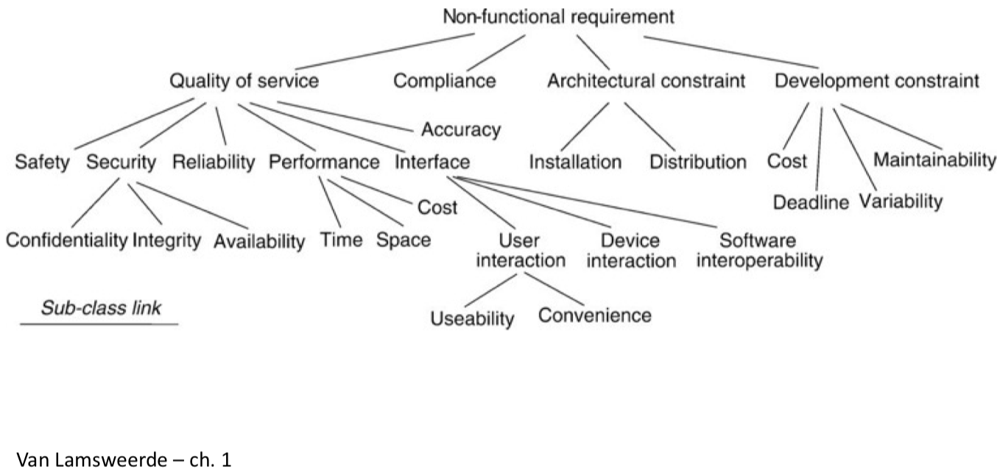

# Software Requirements Analysis Notes

Summary is wriiten by Yixiong Ding  
The University of Melbourne  
June, 2018   
_ _ _

## Interviews
_ _ _

### Communication principles
1. Listen to the client
2. Prepare yourself
3. Have a facilitator
4. Best face to face
5. Take notes
6. Collaboration
7. Stay focused
8. Always move on
9. Not a contest

### Types of interviews
1. Structured interviews
    - More focused
2. Unstructured interviews
    - Might identify unexpected issues
3. Semi-structured interviews

### General interviewing protocol
1. Identify candidate
    - What data are you after?
    - Need to understand the organisation
2. Plan interview
    - What do you want to get out of it?
    - Learn about the domain and terminology
3. Conduct interview
    - Follow up answers
    - Ask questions and record answers
4. Analyse results
    - And go back to interviewee to get feedback/validation

### Interviewing guidelines
1. Identify complete set of stakeholders
2. Establish rapport
3. Friend not foe
4. Focus on the interviewee work and problems
5. Keep open ended questions for the end
6. Follow up interesting answers
7. Ask the ‘why’ of pre-established solutions
8. Avoid questions
    - Opinionated or biased
    - Imply an answer
    - You know the answer
    - Silly – answered by previous research
9. Look at the data soon before you forget non-verbal factors
10. Keep people in the loop
11. Never say “usually”
12. Encourage stories
13. Find inconsistencies
14. Non-verbal cues
15. Don’t fear silence

### Focus groups
1. Interviews with more than one participants
2. Will save time, larger pool of opinions
3. Risky if there are alpha individuals
    - They will bias the discussion
    - Less dominant individuals will not express different opinions or will agree
4. Personal agendas might silence opinions
5. Harder to analyse recordings because of different voices

_ _ _
## Software Processes
_ _ _

### Software projects
1. Software projects replace existing systems (even if a manual one)
2. The system-as-is vs the system-to-be
    - The system-as-is
        - Reports on documentation flows, work procedures, business rules, defect and complaint reports, change requests, user manuals...
    - Often the system-to-be will interact with other software, people and processes
3. “Easy” vs “hard” problem domains 
    - Get to know the problem domain 
    - Share the client's lexicon

### Why building a system?
1. Students often not exposed to the Business Brief
2. Motivation of the system-to-be
    - Why is it necessary?
    - Goals?
    - How does it fit in the business strategy?
3. Define the boundaries software/system 
    - System > Software 
4. Scope and scope creep 
    - Prioritise!

### A classic waterfall process

### Requirements Engineering
1. Finding out what the client wants
2. Foundation for rest of development
3. Requirements engineering
    - Repeatable process of gathering and refining requirements
4. Harder than it looks like
    - Communication with client essential

### A classic RE process
1. Inception
    - Basic understanding of the problem, identify the people who want the solution, the nature of the solution
2. Elicitation
    - What is to be accomplished, how the system fits into the needs of the business, and how the system will be used on a day-to-day basis
3. Specification/Modelling
    - Refining the elicited data as requirements models
4. Negotiation
    - Scoping with client, bringing together various viewpoints, resolving conflicting requirements, prioritizing requirements
5. Validation
    - Ensuring the specification is correct, unambiguous, and free of inconsistencies. Validate with stakeholders to establish baseline
6. Requirements management
    - Maintain changes in requirements throughout the lifecycle of the system

### An agile process

### An agile inception
1. Helps reach alignment and set expectations
2. Team gets ready to start a project
3. Typically a 1 or 2 day meeting
4. Involves dev team and clients
5. Elements:
    - Vision and goals
        - Motivation of the project and main goals
    - Non-goals
        - What’s out of scope
    - Risks
        - Brainstorm, prioritise and revisit
    - Roles / personas
    - Activities / workflows
    - Stories
        - Later decomposed into tasks
    - Estimations
    - Priorities
    - Retrospective

_ _ _
## Goal modelling
_ _ _

### Models
1.  Abstraction from real world
    - Support the understanding of some aspect
2. They represent information needed for the development
    - Do not over-elaborate
    - Stop when there is a base for design
3.  Support discussion between stakeholders
4. Empowering
    - Brings you closer to the final product

### Do, be, feel lists
1. One efficient way of eliciting requirements
    - Complementary to interviews
2.  Structured form of brainstorming
3. A workshop activity involving many stakeholders
    - Can capture viewpoints or partial views of the problem

#### Preparation
 1. Participants
    - Facilitator: run the activity
    - Scribe: write down participant’s suggestions
    - Range of stakeholders involved in the problem
2. Resources
    - Markers (3 different colours if possible)
    - Whiteboard or similar – 15 to 30 minutes

#### Introducing the activity
1. Explain purpose of the session(project purpose)
2. Explain the 4 categories
    1. Do
        - What should the system do?
    2. Be 
        - How should it be done? Constraints on features
    3. Feel
        - Emotional (or social) considerations or concerns regarding features
    4. Who
        - Types of stakeholders involved in the system

#### Populating the lists
1. Ask the audience for contributions
2. Write down ideas under the right category 
    - Different colours for different categories?
3. No strict order
4. Brainstorming principles, e.g. no filtering out

#### Prioritising
1. Optionally end the activity extracting priorities
    - Longer session
2. Many different techniques
    - Pick a lean technique
3. Do it now or later
    - If later, your ideas will be clearer
    - If now, stakeholders have the discussion fresh and are together to discuss inconsistent perceptions

#### Close the activity
1.  Record the results
    - Photo? Counting dots?
2. Thank participants
3. Explain the process
    - Analysis of result
    - Return to them for clarification and feedback

### Goal model
1. Visual representation of goals and involved actors
2. In traditional software engineering
    - Semi-formal specification
    - Used to derive other lower level models leading to design
3. Our purpose
    - Conversation starter between client and dev team
    - Represents shared understanding of the problem
    - Notation easy to understand for non-technical stakeholders
4. Two possible levels
    1. Motivate the project, describe the problem
    2. Describe general aspects of the sought system (non-technical!)
5. 1 and 2 combined in one diagram in some cases

#### Elements of a goal model
1. Functional goals
    - High level functional requirements 
    - Parallelograms
    - Actions – start with verbs
2. Quality goals
    - Non-functional requirements
    - Clouds
    - Adjectives – qualify the functionalities
3. Emotional goals
    - Social issues, personal values, non-traditional quality requirements 
    - Hearts
    - I want to feel...
4. Concerns
    - Risks, conflicting views... - things to take into account during the project – Spades, inverted hearts
5. Roles
    - Actors responsible for goals or involved in them

#### Hierarchy of functional goals
1. Top-down
    - More general to more specific
    - Answer how the super-goal will be achieved/decomposed?
2. Bottom-up
    - Specific to general
    - Answer why the sub-goal is done?

#### Example of goal model

### Starting point
1. A collection of key concepts in the domain
    - From interview analysis
    - From other elicitation mechanisms 
        - E.g. do, be, feel lists
2. Review as a team for
    - Ambiguities – multiple interpretations
    - Redundancy
    - Need for clarification
3. Note all assumption to check with clients later

### Do, be, feel lists / goal model mapping
If using the list workshop
1. Do list
    - functional goals
2. Be list
    - quality goals
    - Traditional non-functional requirements
        - Performance, security, robustness, reliability...
    - Other quality factors (some might be related to the above 
    - Mobile, visual, immediate
3. Feel list
    - emotional goals 
    - concerns/risks
    - Engaged, empowered, connected, hopeful, normal
4. Who list 
    - roles

### Creating the hierarchy
### Adding qualities and emotions
### Feedback from the client
### Frequent issues

_ _ _
## Personas
_ _ _

### What are personas?
1.  A model of users
    - Not real but based on real data
2. Describe a group of users
    - What they want to accomplish 
    - What are their motivations
    - How they behave
    - How they think
3. Inform the product design 
    - Ideation
    - Validation of design concepts

### Choosing your audience
1. Designing broad functionalities to reach a wide audience
    - Many features
    - Increase cognitive load
    - Make the interaction harder
2. Choose right individuals to design for 
    - Represent the needs of large groups
    - Prioritise their needs
    - If possible satisfy secondary users

### Strengths of personas
1.  Determine what the product should do and how it should behave
2. For discussion with stakeholders – simple
3. “In vitro” user testing
4. Marketing tools
5. Avoid
    - Designing for a generic user
    - Developer’s goals
    - Edge cases – how often this function will be used?

### Effectiveness of personas
1. Based on research on real people
2. Engage the empathy of the design and the development team around the users’ goals
3. If well done make developers care more about making them happy with a better experience

### Personas are not...
1. Not anaverage user
    - Exemplary or definite behaviour within the range 
    - E.g. make between $50k-$70k p.a.
2. Not stereotypes
    - Antithesis of well-developed personas
    - Result of the developers’ biases and assumptions – E.g. all older adults are bad with technology
3. If not sufficient evidence
    - Might need supplementary data
    - Err on the side of diversity (gender, ethnic, age...)

### A complete process for persona creation
1. Group interview subjects by role
2. Identify behavioural variables
3. Map interview subjects to behavioural variables
4. Identify significant behaviour patterns
5. Synthesize characteristics and define goals
6. Check for completeness and redundancy
7. Designate persona types
8. Expand the description of attributes and behaviours

### Goals of personas
1. Goals are drivers(motivations) behind people’s behaviours
    - Why does somebody perform certain tasks?
    - Personas must have goals related to the system
2. Answer to why and how a persona would use a product
    - Great help for the developer to keep the big picture
3. Identified and summarised in one sentence
4. 3 types of goals related to how we process emotions

### How does our brain process emotions?
Three levels:
1. Visceral
    - Look&Feel
    - Immediate impact, fast
    - Consistent for most people
2. Behavioural
    - Use and experience of a product
    - Related to functionality, performance and usability 
    - Consistent for most people
3. Reflective
    - Meaning of a product and its use, over time 
    - Related to culture and self-image
    - Non-consistent for most people

#### Personas’ experience goals
1. Visceral level of cognitive processing
2. Visual appearance and other senses
    - Designing for affect – emotional response for the particular context
    - Often beautiful, but not always (E.g. music player VS banking app)
3. How the user wants to feel
    - Smart, in control, fun, reassured about security, relaxed, focused and alert...

#### Personas’ end goals
1. Behavioural level of cognitive processing
2. The behaviour of the system should complement the users’ behaviour and mental process
3. What the user wants to do (motivation for using the system)
    - Be aware of problems before they become critical 
    - Stay connected with friends
    - Find music that I love
    - Get the best deals

#### Personas’ life goals
1. Reflective level of cognitive processing
2. Designing for building long-term relationships
    - Very hard to create personal or cultural associations 
        - Sony Walkman, iPhone, Facebook
3. Who the user wants to be
    - Deep drives and motivations
    -  Explains why the user wants to achieve the end goals
        - Live the good life
        - Succeed in my ambitions to...
        - Be attractive, popular, respected...
4. They won’t directly affect the development but a system that gets people closer to their life goal will be highly successful

### Behavioural patterns
1. How does somebody behave in relation to some aspect relevant for the system?
2. Each behavioural pattern covered by a different persona
3. Avoid redundant behavioural patterns – If two personas behave similarly
    - No value to understand more about the system – In some cases redundancy is useful
4. Based on behavioural variables

#### Behavioural variables
1. Useful to find the behavioural patterns
    - Typically not just demographics
2. They hold a range of values
    - E.g. Education: No education, Secondary, Undergrad, Postgrad, PhD
        - Discrete values
    - E.g. Computer use skill: Value between not at all to highly skilled
        - Continuous 
3. Look at
    - Activities: what the user does, how often
    - Attitudes: what the user thinks about domain and technology 
    - Aptitudes: users’ education and learning ability
    - Motivation: why is the user engaged in the problem
    - Skills: users’ abilities related to domain and technology
#### Significant behavioural patterns
1. Based on real data
    - Identify relevant behavioural variables
    - Define behavioural patterns as combination of variables values with logical connection
2. E.g. a music app
    - Doing sports more than 3 times per week, listening to music while being active
    - Doing sports less than once per week, listening to music to relax
3. Can you eliminate behaviours and get the same result?   
    - Irrelevant variables for persona creation
    - Compare
        - Listening to music and regularly buying music 
        - Listening to music and being vegetarian
### Defining a persona

### Types of personas

#### Primary
1. Main target, one per interface
    -  E.g. healthcare IS, one for medical, one for financial
2. The primary person must be satisfied with the design 
    - Other personas will not be dissatisfied
3. If unclear which one is the primary persona, define multiple interfaces
4. If there are several primary personas for a customer product, the scope is too broad
5. The primary persona is not necessarily the largest segment market
    - E.g. OXO Good Grips for people with arthritis

#### Secondary
1. Mostly satisfied with the primary persona’s interface
2. Additional needs that do not upset the primary persona’s – Not always necessary
3. Design first for the primary then adjust for the secondary

#### Supplemental
1. Their needs are represented by a combination of those for primary and secondary personas
2. No need for further adjustment
3. Political personas are a good example of this 
    - To address stakeholders assumptions
4. Others: customer, served or negative

### Personas in the development lifecycle
 Use your personas!
1. Ideation
    - Talk about the functionality that they need
2. Base the design on their particularities 
3. Sounding board while designing
    - Would Peter like this? 
4. Evaluation
    - Pre-user testing 
5. Sell your product
    - Present your work to client or third parties

_ _ _
## Paper prototypes
_ _ _

### Paper interfaces
1. Quick drawing of the interface
2. Users test it
    - Explain scenario
    - Ask them to perform a task
2. Encourage users to talk aloud 
    - Explain their intentions
    - Explain their actions 
    - Ask questions
3. Take notes! (or video)

### Interactive paper interfaces
1. Static VS Interactive
2. Very simple technique
3. Interactions cause changes 
    - Replace the sketch
4. Example of mechanism (Buxton) 
    - No content
    - Focus on interaction 
    - Easy to replicate

### Use them for ideation
### Use them for early user testing
### Use them for usability testing
### Paper prototypes for co-design
1. Collaborate with the client to create the paper prototype
    - Hand-drawn, not printed
2. Bring screen templates and cut-outs of interface elements
    - Buttons, search bars, maps...
    - If in a rush, find mockups of elements in the Internet
3. Work with the client to position them 
    - Encourage think-aloud
4. Create more elements on the fly 
    - Be prepared with paper, pens...
5. End up with a “perfect interface” for the client
### On multiple versions
### How people think
### Wrapping up
1. Intended to be rough sketches
    - Reinforces the idea of not being finished • Don’t use a computer if possible
    - Very quick
        - A couple of minutes to draw an interface 
        - Don’t use rulers (make them look rough)
    - Make many of them and throw them away
2. Make a very inexpensive prototype
3. Affordable to compare alternative solutions

_ _ _
## Elicitation techniques
_ _ _

### Questionnaires
1. Prepare and send out a questionnaire with predetermined set of answers
    - Multiple choice
        - Who should be the target group of the system? 
            - a) Students
            - b) Young professionals 
            - c) Young families
    - Likert scale
        - The app should appeal to young families the most 
            - Strongly agree 1 2 3 4 5 Strongly disagree
2. Obtain subjective information 
3. Pros
    - Low cost
    - Remote respondents 
    - Large pool
4. Minuses
    - Biased information due to
        - Sample of people you chose to send to
        - Subset of responses of people who chose to respond 
        - Set of questions that you chose
        - Set of answers that you predetermined for questions
    - No direct in teraction with respondents
    - No guarantee of response
    - Hard to provide context for questions
    - Ambiguous questions can lead to useless information
5. It has to be carefully designed
6. Validate questionnaires with other people to mitigate problems
    - Statistical significance of target audience
    - Adequate coverage of questions and answers
    - No bias in formulation and presentation of Q&A – No ambiguity in formulations of Q&A
7. Some implicitly redundant questions might help
8. A complement to interviews (leading to)
9. How many/What type of questions are you happy to answer?

### Repertory grids
1. Useful to learn more about certain concepts
2. Have one card per concept
3. Ask participants to characterise them with 
    - Attributes
    - Values (ranges) for those attributes 
    - For instance

### Card sorting
1. Useful to understand implicit classification criteria
2. One concept per card (text or picture)
3. Stakeholder partitions the cards into subsets
    - Why those groups?
4. Useful to design simple interfaces
    - Pieces of info needed for certain tasks
        - What info does an instructor need to take the roll VS to request for a fill-in?
5. How do you group options in interfaces?

* External Source:
1. Card sorting is a method used to help design or evaluate the information architecture of a site.
2. In a card sorting session, participants, here are the stakeholders organize topics into categories that make sense to them and they may also help to label these groups. To conduct a card sort, you can use actual cards, pieces of paper, or one of several online card-sorting software tools.

### Observation and ethnographic studies
1. Observing someone doing their job might help understand the problem
    - E.g. Explain how to tie shoe laces
2. Great to elicit tacit knowledge
3. Appropriate in complex organisations or different cultural contexts
4. Passive vs Active observation
    - Ethnographic study: longer term, dynamics of the group, attitudes, reactions, gestures, chats, jokes...
    - Protocol analysis: follow a protocol while explaining it
4. Very expensive
    - Longtime, different work conditions...
5. Needs to create the trust so they allow for it
6. Also, be aware of the Hawthorne effect

#### Storyboards
1. Loose-form narrative to learn:
    - how things are (system-as-is)
    - how things should be (system-to-be)
2. Tell the story as a series of quick and easy-to-understand snapshots 
    - Sentence, sketch, picture, slide, screenshot...
3. Passive
    - Tell a story for understanding and validation
        - E.g. How somebody takes the roll 
4. Active
    – Joint effort with client for exploration
        - E.g. How a new app would help taking roll
5. Cover
    - Roles
    - What happens to them (through episodes)
    - Why things happen
    - What-if scenarios and (negative) consequences
6. Starting with a script makes things easier

#### Scenarios
1. Structured storyboard form 
    - Typically textual
2. Uses concrete examples
    - Easier to understand
    – More realistic responses from the user
        - I type in my address: “1 Flinders St, Melbourne” 
        - VS The user types in their address
3. Goals during RE
    - Understanding how things are in the system-as-is
    - Understanding how things should be in the system-to-be
        - Used to ask specific questions
            - How needs to received this form to approve it?
        - Used to understand underlying motivations or goals
            - Why can’t you send this form directly to your line manager?
        - Used to represent desired behaviour
            - When you click on “Generate” what exact information do you want to see?
4. Positive vs Negative scenario
    - Counter-example of what should not happen in the system
    - Ask for the reasons to uncover tacit requirements
        - After 3 unsuccessful attempts to type in PIN, the ATM returns the card
5. Normal vs Abnormal scenario
    - Alternative flows
    - How many do I cover?
        - Making a mistake typing in the PIN, electrical error in the card reader, user being robbed
6. Advantages
    - Concrete and easy to understand
    - Bring to the same page stakeholders with partial views and various backgrounds
7. Problems
    - Partial, very hard to be comprehensive
    - Multiple granularity levels from different stakeholders, hard to integrate 
    - Over specification in the order of interactions (are all necessary?)
8. They do not detail the motivation of interactions

### Content analysis
1. Data is useless if no conclusions can be drawn
2. Often, large volume of raw data 
    - E.g. interview transcripts
3. There are formal definitions but in essence 
    - Read the material to identify themes
        - E.g. tasks of users, pain points of users...
    - Themes depend on the purpose of the analysis

_ _ _
## Agile and Agile Requirements
_ _ _

### Limitations of classic development methods
1. Heavyweight development processes(e.g. waterfall)
    - Too slow
    - Too much documentation
    - Too hard to adapt to changes
    - Very hard to freeze requirements
    - Typical requirements document: IEEE 830/1998 SRS 
        - Software Requirements Specification
2. Too often projects run over-time, -budget, or worse...

### Agile principles 
1. Our highest priority is to satisfy the customer through early and continuous delivery of valuable software
2. Welcome changing requirements, even late in development. Agile processes harness change for the customer's competitive advantage
3. Deliver working software frequently, from a couple of weeks to a couple of months, with a preference to the shorter timescale
4. Business people and developers must work together daily throughout the project
5. Build projects around motivated individuals. Give them the environment and support they need, and trust them to get the job done
6. The most efficient and effective method of conveying information to and within a development team is face- to-face conversation
7. Working software is the primary measure of progress
8. Agile processes promote sustainable development. The sponsors, developers, and users should be able to maintain a constant pace indefinitely
9. Continuous attention to technical excellence and good design enhances agility
10. Simplicity - the art of maximizing the amount of work not done - is essential
11. The best architectures, requirements, and designs emerge from self-organizing teams
12. At regular intervals, the team reflects on how to become more effective, then tunes and adjusts its behavior accordingly

### An agile process

### Scrum
1. One of many different versions of agile
    - Do your shopping to find which flavour you like best
    - You'll have to adapt to the method used by your (future) employer
2. Hard to completely understand the problem from the beginning
3. Requirements are volatile, hard to predict
4. Not realistic to stick to a plan regardless
5. Accept this and be quick to adapt 
    - Unexpected new requirements
    - New technologies
    - New market conditions

### Scrum Roles
#### Product owner
1. Defends the client's interests
2. Writes user stories
3. Defines when a user story is “done”
4. Prioritises user stories
5. Adds user stories to backlog per sprint
6. Stays away from technical aspects of development

#### Scrum master
1. Ensures integrity of Scrum process
2. Facilitates team events
3. Steers team towards improvement
4. Manages backlog and determines the completion of tasks
5. Promotes self-organisation of team 
    - Micromanages at times

#### Development team 
1. Self-organised
2. Analyse, design, develop, test. . .
3. Should be capable of tackling complete iterations

### Agile meetings

#### Sprint planning meetings 
1. 1 hour per week/sprint
2. Roles
    - Scrum master 
        - facilitates
    - Product owner
        - clarifies requirements
        - defines acceptance criteria 
        - resolves dependencies
    - Entire agile team
        - determine effort involved
3. Define the sprint backlog
    - Correct story size (vertical slice)
    - Consider sprint duration, velocity, priorities, item size

#### Daily stand-up meeting
1. Daily (first thing?), but in 15 minutes or less • It’s not a problem solving meeting
2. Each member commits to each other
3. Daily stand up
    - What did I do yesterday?
    - What am I doing today?
    - Any impediments in my way?
4. Do I need help or solve dependencies?

#### Sprint review meeting 
1. About 30 minutes per sprint
2. Demo a product improvement
    - A live demo, not a report!!
    - Ideally with the client to get valuable feedback
3. Assess only items that are completed 
    - Including QA, i.e. shippable features
4. Incomplete items go back to product backlog
5. Product owner rethinks priorities 
    - New scope might take priority

#### Retrospective
1. Last thing of each sprint – about 1 hour
2. Always possible to improve
3. Everyone
    - What is not working and we should stop doing?
    - What are doing well and should keep on doing?
    - What should we start doing?
4. After the brainstorm vote decisions for next sprint

### Product backlog
1. Requirements structure in Scrum
2. What will be delivered
    - In the order that it will be delivered
3. At the beginning of a sprint, items
    - Move to Sprint Backlog
    - Only ready the ones that can be completed in one sprint
4. If too big for one sprint, they will need decomposing
5. Continuously evolving
    - Initially only well-understood requirements
    - Dynamic changes to keep the product competitive and useful
    - Change with business requirements, market or technology changes 
    - The ones at the top (higher priorities) have better estimates
6. Ordered by the product owner depending on
    - Client’s priorities – what gives more value to the client
    - Dependencies

### Priorities in agile
1. Many approaches, choose what works best for the team
2. Order in product/sprint backlog
3. MoSCoW
    - M: Must
        - Essential for the success of the project
    - S: Should
        - High priority, often critical, but if absolutely necessary can be do somehow else
    - C: Could
        - Desired but not essential, if time allows
    - W: Won’t
        - Will not happen for certain release, maybe for the future
4. Cumulative voting
    - Stakeholders distribute limited resources across features (e.g. dots, $...)
5. Priority = Urgency X Value
    - Urgency: time constraints, dependencies...
    - Business value: important for many customers, impact on brand or reputation, competitive advantage

### User stories in the product backlog
1. User stories relate directly to user’s required features
    - E.g. compare “buy a book” vs “login”
2. There are standard formats, for instance
    - [num] As a [role], I want to [do something], so that [I get some benefit] [Weight]
        - IDs are good to refer to items in lists of user stories, quality requirements... 
3. Acceptance criteria
    - Describe when a user story has been completed (“done”)
        - Only when a story is done, it can be demoed
        - Completing it also means that it has undergone QA
    - Defined at the same time that user stories are written
        - By the product owner
4. A useful template
    - Given [some precondition], when [I do some action] then [expected result]

#### Example of user story
1. As a customer, I want to withdraw cash from an ATM So that I don't have to wait in line at the bank.
2. Given that the account has credit And the card is valid And the dispenser contains notes, When the customer requests the cash Then ensure the account is debited And ensure cash is dispensed And ensure the card is returned.

#### Sizes of user stories
1. User stories have story points (or sizes, weights)
    - How much effort is associated to its implementation
    - Many metrics for story points
        - E.g. Fibonacci numbers, T-shirt sizes
        - Their purpose is for comparison
        - Hard to estimate well without much experience and knowing well your team
2. Each agile team should know how much weight they can pull per sprint
    - Team Velocity changes while teams adjust to each other
    - Velocity = number of story points per sprint
    - Target is that the estimated story points and completed story points converge

#### Granularity of user stories
1. Not all user stories have the same granularity
1. A good taxonomy
    - Epic > Feature > Technical User Story > Tasks
    - Epic
        - Big picture, high-level overview of functionality
        - Epics provide new services, as an aggregation of features
        - Measured in story points
    - Feature
        - More detailed than epics but too large to be implemented
        - Capability or a slice of business functionality meaningful to a customer, as an aggregation of technical user stories
        - Measured in story points
    - Technical user story
        - Something of business value that can be done in one sprint, as an aggregation of tasks 
        - As a..., I want to..., so that...
        - Measured in story points
    - Tasks
        - Describe steps to build some user story
        - Measured in hours
        - Not in the product backlog (only in sprint backlog)

##### Example of taxonomy 
1. Epic
    - Manage banking accounts online
2. Feature
    - Transfer funding to other accounts
3. Technical User Story
    - As a patron of the bank I want to pay bills from my online bank so that I don’t need to go to the bank to do it
4. Task
    - Store the details of a new Payee

#### Practical applications of user stories
1. Conversation starters
    - Between dev team and product owner to clarify needs 
    - Incomplete requirements until discussed
2. In practice:
    - The priority and weight are important
    - You only discuss about the ones that will be developed next
        - Just-In-Time work
    - Probably you will need to readjust as sprints go

_ _ _
## User Acceptance Testing
_ _ _

### What is UAT
1. Client determines whether they accept the software 
    - Fit for purpose
    - Including quality requirements
2. Often based on contractual agreements
3. Just before the product is deployed
    - In agile, before sprint review meeting
4. Black-box type of testing
    - Concrete examples!
5. After the product has gone through all the other tests 
    - Unit testing
    - Integration testing 
    - System testing

### What to test
1. Follow the acceptance criteria
2. Define scenarios of usage
    - E.g. Book an appointment for **Thursday 12 April** at **9.30am** with **Doctor Smith** at the **Parkville Clinic**
3. Cover all key business functionalities
    - Prioritise functionalities with higher value for client
4. The development team runs the tests internally before going to the client
    - Avoid surprise bugs!
5. Two ways of running it with the client
    - Demo based – you run it
    - User driven – the client runs it

### Test case
Many different templates
- Create your own with the info that you need
- E.g. As a patient, I want to book online an appointment with my GP, so I can see availabilities and I can do it at any time

### The session
1. Before the session
    - Internal run of the UAT
    - Ensure that there are no bugs 
    - Give the client the test cases
        - The tasks or scenarios that they will run
2. Bring together
    - Client
    - QA team (or representative) – Dev team (or representative)
3. If bugs are found, a decision has to be made
    - Fix before going live
    - Leave the bug in
    - Leave it in for a future fix
4. Result of the UAT session 
    - Go
    - No-go (yet)
5. Get back to the client
    - With answers, decisions or demos showing the fix or feedback

#### Practical advice
1. Have the demo setup ready and populated with meaningful data
2. Tell a story (context)
    - Perform meaningful tasks for the business
    - In most cases you don’t need to show how you log in (just mention it) 
    - Don’t show isolated bits and pieces
3. Use realistic data
    - “asdf” and “111” VS “Michael Smith” and “0412 654 741”
    - Different values for different fields
        - E.g. if numeric values are needed change them, “number of groups” and “number of team members per group” 
4. Talk through the demo
    - Have somebody else operating the machine
5. If a form has many fields pre-fill them (or have them ready on another screen)
6. Convince the client that you’ve done your best
    - E.g. Test results as statistics, don’t be too technical

#### Things to avoid in a session
1. Do not base the demo on functionalities
2. Do not start the demo with “This is how we create a user”
    - What will the client spend 80% of the time doing?
3. Do not spend too long filling in forms
4. Do not use meaningless data
5. Do not move too quickly between screens
6. Avoid technical hiccups – practice beforehand in the same environment if possible
    - E.g. Screen connectors
7. Don’t hide problems, but describe known bugs beforehand
    - “Oh yeah, I knew that might happen...”
8. Don’t argue/agree with the client, just record and come back to them later
    - Can you change the colour of A?
    - I’m pretty sure that you said you would implement X, Y and Z

### Acceptance Test VS Acceptance Criteria
1. Students often mix them up
2. What’s the difference?
3. Acceptance Criteria
    - Goes with the user stories
    - Given [some precondition], when [I do some action] then [expected result]
    - The developer of the user story uses to decide when they are ready to pass on the code for testing
4. Acceptance Test
    - At the end of other testing
    - OO analogy
        - An instance of the acceptance criteria
    - Step by step scenario
        - Uses concrete examples
    - To be consumed by the client

_ _ _
## Quality requirements
_ _ _

### Content Map

### Types of requirements 
1. Functional
    -  What should the system do?
2. Non-functional (aka quality)
    - How should the system be?
    - What constraints should it have?
        - Security, usability, flexibility, connectivity, privacy, reliability, extensibility . . .
    - Might need balancing and prioritisation
        - E.g. Security VS Usability or Performance
3. Other less traditional non-functional requirements?
    - Have fun, feel challenged, recognised, popular, in touch...
    - Instagram minus social / emotional requirements?

### Value driven requirement engineering
### Non-functional requirements
1. Define constraints on how the software-to-be
    - should satisfy its functional requirements
    - should be developed
2. Not always clear separation between
    - Functional and non-functional
        - The safety injection signal shall be on whenever there is a loss of coolant except during normal start-up or cool down.
    - Non-functional categories
        - The requirement to send acceleration commands to trains at very high frequency is related to both performance and safety
3. Often, open for discussion

### Requirements taxonomies 
1. Many types of non-functional requirements
    - A taxonomy is useful 
2. Taxonomies can help
    - Identify hidden requirements
        - Do I have any confidentiality requirements in the system?
    - Identify conflicts between requirements
        - Any conflicts between confidentiality and usability requirements?
3. Not exhaustive, but gives good indication of main classes of non-functional requirements

#### One taxonomy

#### Safety
Safety requirements are quality requirements that rule out software effects that might result in accidents, degradations or losses in the environment
- The controlled accelerations of trains shall always guarantee that a worst-case stopping distance is maintained between successive trains.

#### Security
Security requirements are quality requirements that prescribe the protection of system assets against undesirable environment behaviours.
1. **Confidentiality** requirements state that some sensitive information may never be disclosed to unauthorized parties.
    - A non-staff patron may never know which books have been borrowed by others.
2. **Integrity** requirements state that some information may be modified only if correctly done and with authorization.
    - The return of book copies shall be encoded correctly and by library staff only.
3. **Availability** requirements state that some information or resource can be used at any point in time when it is needed and its usage is authorized.
    - Information about train positions shall be available at any time to the vital station computer.

#### Reliability
Reliability requirements constrain the software to operate as expected over long periods of time. Its services must be provided in a correct and robust way in spite of exceptional circumstances.
- The train acceleration control software shall have a mean time between failures of the order of 100 hours.

#### Performance
Performance requirements are quality requirements that constrain the software’s operational conditions, such as the time or space required by operations, the frequency of their activation, their throughput, the size of their input or output and so forth.
- Acceleration commands shall be issued to every train every 3 seconds.
- The new e-subscription facility should ensure a 30% cost saving.

#### Interface
Interface requirements are quality requirements that constrain the phenomena shared by the software-to-be and the environment
- static and dynamic aspects of software- environment interactions
- input/output formats 
- interaction sequences

#### Useability and Convenience
1. Useability requirements prescribe input/output formats and user dialogues to fit the abstractions, abilities and expectations of the target users.
    - The format for bibliographical queries and answers shall be accessible to students from any department.
2. Other human interaction requirements may constrain software effects so that users feel them to be ‘convenient’ in some system-specific sense.
    - To ensure smooth and comfortable train moves, the difference between the accelerations in two successive commands sent to a train should be at most X.

#### Interoperability
For interaction with devices or existing software components, interoperability requirements prescribe input/output formats and interaction protocols that enable effective cooperation with those environmental components.
- The meeting scheduling software should be interoperable with the WSS Agenda Manager product.

#### Accuracy
Accuracy requirements are quality requirements that constrain the state of the information processed by the software to reflect the state of the corresponding physical information in the environment accurately.
- A copy of a book shall be stated as available by the loan software if and only if it is actually available on the library shelves.
- The information about train positions used by the train controller shall accurately reflect the actual position of trains up to X metres at most.
#### Compliance
Compliance requirements prescribe software effects on the environment to conform to national laws, international regulations, social norms, cultural or political constraints, standards and the like.
- The value for the worst-case stopping distance between successive trains shall be compliant with international railways regulations.
- The meeting scheduler shall by default exclude official holidays associated with the target market.
#### Architectural
1. Distribution constraints on software components to fit the geographically distributed structure of the host organization, the distribution of data to be processed, or the distribution of devices to be controlled.
    - The on-board train controllers shall handle the reception and proper execution of acceleration commands sent by the station computer.
2. Installation constraints to ensure that the software-to- be will run smoothly on the target implementation platform.
    - The meeting scheduling software should run on Windows version X.x and Linux version Y.y.
#### Development
Development requirements do not constrain the way the software should satisfy its functional requirements but rather the way it should be developed. These include requirements on development costs, delivery schedules, variability of features, maintainability, reusability, portability and the like.
- The overall cost of the new UWON library software should not exceed X.
- The train control software should be operational within two years.

### ISO/IEC 25010:2011
1. ISO – International Organisation for Standardisation
2. IEC – International Electrotechnical Comission
3. Develop, maintain and promote standards for IT and ICT
4. Systems and software engineering -- Systems and software Quality Requirements and Evaluation (SQuaRE) -- System and software quality models
5. A product quality model
    - Static properties of software and dynamic properties of the system 
    - Refers to computer system and software product
6. A quality in use model
    - Outcome of interaction when a product is used in a particular context of use
    - Refers to human-computer system

### Software product quality model 
#### Functional suitability
- The degree to which the product provides functions that meet stated and implied needs when the product is used under specified conditions
    - Suitability
    - Accuracy
    - Interoperability 
    - Security
    - Compliance
#### Reliability
- The degree to which a system or component performs specified functions under specified conditions for a specified period of time
    - Maturity
    - Fault Tolerance
    - Recoverability
    - Compliance
#### Operability
- The degree to which the product has attributes that enable it to be understood, learned, used and attractive to the user, when used under specified conditions
    - Appropriateness 
    - Recognisability 
    - Ease of use
    - Learnability
    - Attractiveness
    - Technical accessibility 
    - Compliance
#### Performance efficiency
- The performance relative to the amount of resources used under stated conditions
    - Time Behaviour
    - Resource Utilisation
    - Compliance
#### Security
- The degree of protection of information and data so that unauthorized persons or systems cannot read or modify them and authorized persons or systems are not denied access to them
    - Confidentiality
    - Integrity
    - Non-repudiation
    - Accountability
    - Authenticity
    - Compliance
#### Compatibility
- The degree to which two or more systems or components can exchange information and/or perform their required functions while sharing the same hardware or software environment
    - Replaceability
    - Co-existence
    - Interoperability
    - Compliance
#### Maintainability
- The degree of effectiveness and efficiency with which the product can be modified
    - Modularity
    - Reusability
    - Analyzability
    - Changeability
    - Modification stability 
    - Testability
    - Compliance
#### Transferability
- The degree to which a system or component can be effectively and efficiently transferred from one hardware, software or other operational or usage environment to another
    - Portability
    - Adaptability
    - Installability
    - Compliance

### Software quality in use
#### Effectiveness 
The accuracy and completeness
with which users achieve specified goals

####  Efficiency
The resources expended in relation to the accuracy and completeness with which users achieve goals

#### Satisfaction
The degree to which users are satisfied with the experience of using a product in a specified context of use
- Likability
- Pleasure 
- Comfort 
- Trust

####  Safety 
The degree to which a product or system does not, under specified conditions, lead to a state in which human life, health, property, or the environment is endangered
- Economic damage risk
- Health and safety risk
- Environmental harm risk

#### Usability
The extent to which a product can be used by specified users to achieve specified goals with effectiveness, efficiency and satisfaction in a specified context of use
- Learnability
- Flexibility
- Accessibility
- Context conformity

_ _ _
## Technical natural language
_ _ _

### Qualities of good writing
### Specifying requirements
1. Elicited requirements
    – Precisely specified and documented
2. About the system-to-be
3. Help discussion between 
    - Clients
    - Development team
4. Range of formality
    - Informal – e.g. natural language
    - Semi-formal – e.g. domain diagrams
    - Formal – e.g. logic or maths based languages

### Natural language
1. First obvious choice
2. Pros
    - No limitations in expressiveness
    - No communication barrier – No special training required
3. Cons
    - Inherently ambiguous
    - Prone to many types of defect types 
        - Errors – jeopardise the project, failure 
        - Flaws – delay the project

### Stylistic rules for natural language specification
General technical writing applied to RE 
- Identify the audience and write accordingly
- Say what you are going to do before doing it – Motivate first, summarize after
- Define concepts before using them
- One requirement per sentence
- Keep sentences short
- Avoid unnecessary jargon and acronyms
- Use ‘shall’ for mandatory and ‘should’ for desirable statements
- Use examples to clarify abstract statements
- Use bulleted lists for explaining related items that detail
- Use diagrams to simplify complex textual descriptions
- Use figures to provide visual overviews and emphasize key points
- Use tables to collect related facts
- Always refer to figures and tables from the main text
- Avoid complex combinations of conditions with nested or ambiguously associated conditions

### Errors in requirements
1. Omission
    - Problem space aspect feature not stated by any requirement
        - Missing objective, requirement or assumption 
        - Unstated software response to some input
    - Very hard to detect
        - No requirement about the expected state of train doors in case of emergency stop
2. Contradiction
    - Requirements defining a problem space feature in an incompatible way
    - Often, related to conflicting viewpoints
        - Train doors must always be kept closed between stations
        - Train doors must be opened once a train is stopped after an emergency signal
3. Inadequacy
    - Requirement not adequately stating a problem world feature
        - If a book copy has not been returned one week after the third reminder has been issued, the negligent borrower shall be notified that he or she has to pay a fine of £ X
        - If a book has not been returned one week after the third reminder has been issued, a fine of £ X shall be retained from the borrower’s registration deposit and a notification will be sent to the borrower
4. Ambiguity
    - Requirement allowing a problem space feature to be interpreted in different ways – e.g. ambiguous term or statement.
        - Train doors shall be opened as soon as the train is stopped at a platform
            - The front of the train is (stopped) at a platform or The whole train is (stopped) at a platform?
5. Unmeasurability
    - Requirement stating a problem world feature in a way that cannot be precisely compared with alternative options, or cannot be tested or verified in machine solutions
        - Information panels inside trains shall be user-friendly

### Quality factors in requirements
1. Completeness
    - Requirement documentation is sufficient to ensure that the system-to-be will satisfy all its objectives
        - Including quality goals
    - Dedicated requirement to prevent undesirable effects
        - Incidental or intended
    - Describe the output for all possible inputs
    - Sufficient detail to allow for development
2. Consistency
    - Compatibility of all requirements, assumptions and domain properties
3. Adequacy
    - Requirements address the actual needs system-to- be
        - Explicitly or implicitly expressed by stakeholders 
    - Correctly describe laws in the problem space
        - Environmental assumptions must be realistic
4. Unambiguity
    - Requirements formulated in a way that has only one interpretation
    - Terms are defined and used consistently
5. Measureability
    - Requirements formulated at a level of precision that enables
        - evaluation of alternatives
        - verify satisfaction by an implementation 
        - users to determine acceptance
6. Pertinence
    - Requirements model elements of the problem space, not elements of the solution space
    - All requirements contribute to the satisfaction of objectives of the system-to-be
7. Feasibility
    - Requirements must be realizable
        - In terms of budget, schedule and technology constraints
8. Comprehensibility
    - Formulation of requirements, assumptions and domain properties must be understandable by the people who need to use them
9. Good structuring
    - The requirements document structure should reflect relations between requirements
        - refinement or specialization
        - dependency
        - ...
    - The definition of a term must precede its use
10. Modifiability
    - Modifications to documents should be kept as local as possible
11. Traceability
    - Context of requirements should be easy to retrieve
        - Rationale for creation, modification or use
        - Impact of creating, modifying or deleting
            - Dependency within requirements documents
            - Dependency with later artefacts – design, code, tests...

### Flaws in requirements
1. Noise
    - Requirement conveys no information on any problem world feature
        - Every train car will be equipped with a software-controlled information panel together with non-smoking signs posted on every window
2. Overspecification
    - Requirement stating a feature not pertaining to the problem space but to the solution space
    - People tend to think in terms of solution straight away
        - The setAlarm method must be invoked on receipt of a stopAlarm message
3. Unfeasibility
    - equirement that cannot be realistically implemented within the assigned budget, schedule or development platform
        - The meeting scheduler will also make travel arrangements such as flight, car and hotel reservations for every participant who needs to travel to attend the meeting
4. Unintelligibility
    - Requirement stated in an incomprehensible way for those who need to use it 
        - A requirement statement containing five acronyms
5. Poor structuring
    - Requirements not organized according to any sensible and visible structuring rule
        - Intertwining of book acquisition and loan management aspects
6. Forward reference
    - Requirement making use of problem space features that are not defined yet
        - Multiple uses of the concept of ‘participating in a meeting’ in the requirements document and then, several pages later, the definition “A person participates in a meeting if he or she attends that meeting from beginning to end”
7. Remorse
    - Requirement stating a problem world feature too late or incidentally
        - After multiple uses of the undefined concept of ‘participating in a meeting’, the last one is directly followed by an incidental definition between brackets such as (a person participates in a meeting if he or she attends that meeting from beginning to end)
8. Poor modifiability
    - Requirements whose modification may need to be globally propagated throughout the specification
        - Use of fixed numerical values for quantities throughout the requirements document (e.g. for maximum loan period, meeting notification deadline or train speed thresholds), when such values are subject to change over time or from one variant to another
9. Opacity
    - Requirement whose rationale, authoring or dependencies are invisible
        - “The commanded speed of a train must always be at least 7 mph above its physical speed”, without any contextual information about the origin of and rationale for this requirement, and its impact on other requirements

_ _ _
## Digital prototypes
_ _ _

### What are digital prototypes
1. AKA Wireframes
2. Lay out of an application that shows the key interface elements that will be created
3. Shows navigation to ensure expectations are met
4. Do them *early* in the development project
    - Easy to change
5. Natural next step after paper prototypes 
    - Refined version
    - Client can “have a play” on their own time
    - Client feels that “things are moving on” 
        - Sense of progression

### Purpose
1. Enable the client to interact with the system 
    - Focus on functionality of system
    - Show navigation and interactions
2. Important that the client understands that they are only the skeleton of the system
    - A proof of concept
    - Not the final product, but if possible 
        - Fonts
        - Colourschemas
        - Artwork
3. Risk of clients believing that it’s the final thing 
    - Many tools have “sketched looks”

### Examples of sketched interfaces

### Conversation starters
### Uses of digital prototypes
1. Ideation
    - Produce as many potential solutions as possible
    - Discard the bad ones, keep and refine the good ones
2. For usability testing
    - Users perform tasks on the digital prototype based on certain scenario
3. What do you want to get out of them?
    - Low- VS High-fidelity

#### Low-fidelity digital prototype
1. Show only
    - Major navigation elements 
    - Major content elements
2. Don’t show 
    - No colours
    - No images
    - No meaningful contents 
    - Generic fonts
3. Your paper prototype was low-fidelity

#### High-fidelity
1. Start getting into UI design territory
2. Closer to what the final version would look like
3. Include navigation as click through
4. Realistic data and images are important
5. Your navigable prototype will be high-fidelity

### Practical tips 
1. Keep them simple
    - Eventually will be thrown away 
2. Use a grid
    - To ensure that everything is well aligned
3. Add meaningful and concise annotations
    - People refer to it all the time
4. Encourage feedback
    - From dev team and client

### How they fit in SWEN90009
1. During the RE process
    - Paper prototypes building – with the client
    - Paper prototypes video to synthesise the interactions
    - Feedback from client
        - Online or F2F
    - Digital prototype (high-fidelity prototypes)
    - Feedback from client
        - As comments in Confluence
2. At development time
    - Digital prototype will be replicated for the final system
        - During the sprints

_ _ _
## Inconsistent requirements
_ _ _

### Inconsistencies in requirements
1. Multiple viewpoints and concerns
2. Must be detected
3. May be useful to identify hidden requirements
4. Eventually, they need to be solved

### Types of inconsistencies
1. Terminology clash
    - Same concept different names
    - Talking about organising meetings:
        - Attendants to the meeting...
        - Participants to the meeting...
2. Designation clash
    - Same name different concepts
    - Talking about organising meetings:
        - The meeting shall be cancelled if participants decline the invitation
        - Participants that cannot attend the meeting will be sent agenda and minutes
3. Structure clash
    - Same concept different structures
    - Talking about organising meetings:
        - Two different stakeholders talking about available times
            - Monday between 11am and 3.30pm
            - 30-minute slots on Monday at 9.30am and 1pm
4. Strong conflict
    - Always inconsistent when considered together 
    - In logic: R1 AND R2 is always FALSE
    - Talking about organising meetings:
        - The constraints of a participant may not be disclosed to anyone else
        - The meeting initiator should know the participants’ constraints
5. Weak conflict
    - Not always inconsistent together
    - Unless a Boundary Condition (must be feasible) happens 
        - Then it becomes a strong conflict
    - Talking about a library system
        - A borrower shall return a borrowed book within two weeks
        - A borrower should keep a borrowed book as long as they need it
            - What if they need the borrowed book longer than two weeks?

### Handling inconsistencies
1. Terminology, designation and structure clashes
    - Glossary of terms
    - Everyone agrees and follows
        - Following processes is sometimes problematic 
    - Precise and clear definition
    - Include accepted synonyms if needed
    - During elicitation of requirements
2. Strong and weak conflicts harder to solve
    - Look at the causes
3. Typical causes
    - Inherent requirements incompatibilities
        - Security vs usability
        - Confidentiality vs accountability 
    - Conflicting viewpoints
        - Different goals and priorities
        - Understand the motivation of requirements

### Why are there viewpoints? 
1. Large projects
    - E.g. Student management system
        - Enrolments, payments, history, subject management, alumni...
    - Partial expertise
        - Partial uses of the system
    - Need to talk to many stakeholders
2. Each stakeholder is absolutely certain that 
    - their problem is the hardest
    - the most critical to solve
    - they are absolutely right
    - everyone else can wait 
3. Expect multiple viewpoints
    - Strong opinions

### Dealing with conflicting viewpoints
1. Identify the key stakeholders
2. Determine win conditions
3. Identify risks and uncertainties of win conditions
4. Negotiate with everyone to seek 
    - A set of Win-Win conditions
        - Satisfies the needs of as many people as possible 
    - Including for the development team
        - You work under realistic constraints 
            - Resources and deadlines

### For negotiations
1. Identify non-conflicting areas for all stakeholders
    - Stakeholders agree and are happy about the requirements
    - Necessary to establish the starting point for negotiation
2. Identify conflicting requirements
    - Stakeholders have different (clashing) opinions
3. Do not try to decide for the clients
    - You do not want to work against stakeholders
4. Present conflicts to decision makers (somebody senior)
    - They need to resolve and come up with a consistent set of requirements

### Democratic decisions
1. All stakeholders work together for a successful project
2. Make everyone vote to resolve the conflicting requirements
    - Also puts in perspective the importance of requirements
3. Each stakeholder has a number of limited resources
    - Sticky dots, $100, developers...
4. Assign a number of dots to important requirements
5. Once placed, they cannot be reused
6. Count the stickers to determine priorities

### Hints on negotiation
1. It's not a competition or a fight
    - Not winners vs losers
2. Everyone needs to feel they have won – to some extent
3. Be creative and think out of the box
    - How to achieve everybody’s goals at the same time?
4. Listen other parties for real
    - Empathise and understand their needs
    - Don’t wait for a silence to pop out your prepared answer
5. Focus on the other party's interests
    - No hard positions if you want to avoid conflict
6. It's not personal, focus on the problem
7. When a decision is made, commit and move on

_ _ _
## Validation and Traceability
_ _ _

### Requirements validation
1. AKA requirements quality assurance
2. From a Waterfall perspective
3.  Happens as soon as specification / documentation is (partially) completed
4. Aim at finding errors and flaws 
    - Incorrectness
    - Incompleteness
    - Inconsistency
    - Ambiguity...
5. Best identify all problems before moving to next stage
    - Cost of errors increments with time

### A validation process
A general (common sense approach) 
- Identify defects
- Report them
- Analyse the cause
- Take actions to fix them
    - Improved documentation

### Approaches for requirements validation 
Various techniques
1. Queries on a requirements database
    - Requirements in semi-formal language in DB
        - E.g. diagrams
    - Queries check some structural consistency and completeness
2. Animation-based validation
    - Executable formal language
    - Events as input to assess behaviour of spec (targeting adequacy)
3. Formal verifications
    - Formal language
    - Type consistency checks, completeness on decision tables...
4. Inspections and reviews

### Inspections and reviews
1. Widest applicability and scope
2. Applicable to any spec format 
    - Textual requirements
    - Diagrams
    - Formal specifications
3. In short, ask people to look at requirements to find problems
4. Potentially time consuming

### Inspection process
1. Varying degree of formality
    - Internal inspection VS External reviewers
2. A formal process
    - Inspection planning
    - Individual reviewing
    - Defect evaluation at review meeting
    - Documentation consolidation

### Inspection planning
### Individual reviewing
1. Each inspector looks for defects 
    - Whole documentation
    - Part of it
2. Various ways of doing it
    - Free mode
        - No instructions of: which part of the spec or what type of errors
        - Relies on personal expertise
    - Checklist based
        - Follow a checklist of questions or items
        - Directions on what sections to look at
    - Process based
        - Spec split between inspectors
        - Different roles and perspectives
            - E.g. look at safety, performance, domain role... 
        - Specific checklists
        - Specific procedures
            - E.g. different response depending on type of defect

### Defect evaluation and spec consolidation 
1. At review meetings
    - Defects collected and discussed before acceptance
        - Eliminate false positives
    - Identifies the causes of the defects
    - Identifies problems in the RE process
    - Recommends actions
2. Requirements documentation revised to include recommendations

### Type of checklists
1. Defect-based
2. Quality-based
3. Domain-based
4. Language-based

### Guidelines
1. Identify objective facts, not opinions
2. Constructive criticism, not offensive
3. Light weight report that allows for free comments
4. Inspection team different from spec team
5. Include multiple viewpoints and backgrounds
6. Initiate it once the spec is stable
7. Focus on critical aspects of the system
8. Focus on aspects presenting more errors and dependent parts

### Traceability
1. The system-to-be will probably have to evolve 
    - New technologies
    - New policies
    - Changes in the business model...
2. Prepare for change from the beginning of the project
3. Traceability allows to propagate changes along all artefacts in the lifecycle
    - Where does the item come from?
    - Why and where does it go?
    - What will it be used for and how?
    - Follow the life of the requirement **backwards** and **forwards**
    - Traceability can be **vertical** and **horizontal**

### Traceability diagram

### Traceability links
1. Dependency
2. Variant
3. Revision
4. Use

### Maintaining traceability
1. Many alternative methods
2. Cross references
    - Unique identifiers
    - Index or tagging to link elements to others 
    - No semantics
3. Traceability matrix
    - Columns and rows are the items
    - For just one type of relation
    - Back and forth
    - Large are unmanageable and prone to errors
4. Feature diagram
    - Decomposition of features as a tree
5. Traceability database
    - Stores all traceability info

_ _ _
## User Journeys
_ _ _

### What are user journeys?
1. User or Customer journey
    - Scenario depicting how a user/customer interacts with the existing product or product being designed
    - Narrative or visual
    - Based on client research
2. Told from the perspective of the client
    - Many stakeholders in the company, who has the whole picture?
    - Helps improving the client experience and finding new features to develop
3. Consider the complete user experience
    - Not just the software, but the whole package
    - Look at building up satisfaction, trust, loyalty...
        - Not just based on transactions

### Uses
1. Consider the audience (dev team VS executive level)    
    - Technical VS non-technical
    - Level of detail
    - Scope – how much of the story
    - Purpose
        - E.g. identify new feature VS why are we losing clients?
2. Understand users’ behaviour
    - How they currently interact with the system 
    - What are the pain points?
3. Demonstrate how the system could be used 
    - High level of functionality
    - As a narrative
    - Sell your vision

### Business goals for user journeys 
1. Change focus of organisations
    - Is the company letting internal processes affect the consumer experience?
        - E.g. workflow of information -> 24h delay for transactions 
2. Break down silos
    - Marketing does not talk to Accounting
3. Ownership of touch points to departments
    - Who is responsible for addressing a pain point?
4. Target specific (high priority or new) customer
5. Understand quantitative data
    - What are the numbers trying to tell us in terms of client behaviours?

### A deconstructed user journey

### Key elements
1. Persona
    - Who is the journey about?
    - Only one persona per journey
    - E.g. A persona client of online banking app 
2. Scenario
    - What is the experience to represent 
        - Current or exploratory?
    - Based on the user’s goal (but aligned with business goal)     - E.g. Pay an overdue bill
3. Stages
    - Main steps leading to achieving the goal(as timeline)
        - E.g. Receiving the bill, paying the bill, receiving confirmation, request a refund 
    - How does a stage lead to the next one?

4. Actions, thoughts and emotions
    - Based on the research
    - Detail depends on the purpose
        - E.g. Customer introduces the details in the app, feels annoyed because of the extra cost
        - E.g. Confirmation messages points to an error, thinks that need to get in touch with the bank
5. Touchpoints
    - Make explicit when the user interacts with the company
6. Channels
    - Make explicit how the user interacts with the company 
    - In particular by means of technology
7. Opportunities
    - What can be improved in the experience?
    - Any gaps?
        - There is no way in the app to lodge a complaint
8. Ownership
    - Who (e.g. department) is responsible for improving the experience?
        - Client relationships department need to look into it

### Many more formats

### If you want to use them later on
1. If you realise that they could be useful for your job
2. Early in the development process
    - Based on personas
    - Feed later artefacts (e.g. prototypes)
3. The personas will be a very good starting point, providing
    - Users’ goals
    - Motivations
    - Current pain points
    - Overall character
    - Main tasks to achieve
4. One user journey per persona