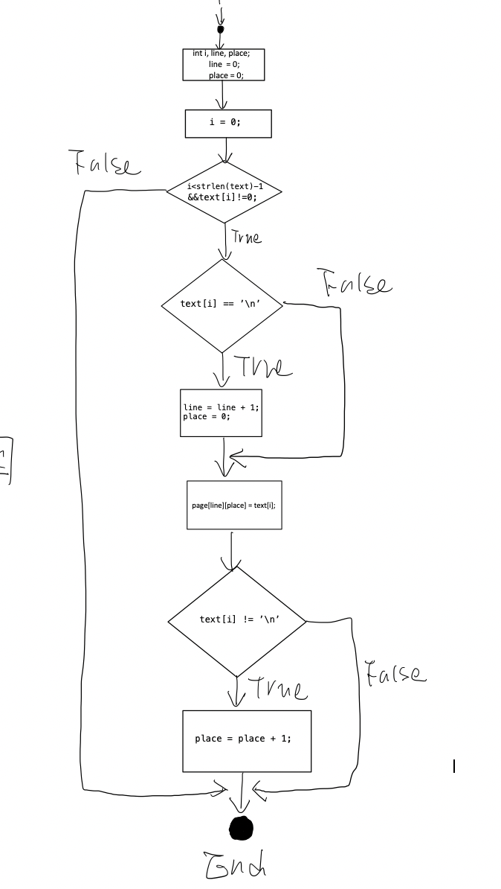

# SWEN90006: Software Testing and Reliability
## Sample Exam 1
### Semester 2, 2016
- - -
Wriiten by Yixiong Ding  
The University of Melbourne  
October, 2018  
_ _ _

### Part A – Functional Testing
#### Question 1
##### (i) [4 marks] Compare and contrast active test oracles with passive test oracles. Your answer should make reference to strengths of each approach and the weaknesses of each approach.
##### Answer:
Active oracle: A program that, given an input for a program-under-test, can generate the expected output of that input.

Strength: 

Weakness:
1. If the active oracle is required to simulate the entire program-under-test, it may be as difficult to implement
2. Can not handle non-determinism

Passive oracle: A program that, given an input for a program-under-test, and the actual output produced by that
program-under-test, verifies whether the actual output is correct.

Strength: 
1. Passive oracles are typically easier to implement than active oracles
2. Less chance of introducing a fault into the oracle itself
2. Can handle non-determinism, a program is non-deterministic if it can return more than one output for a single input

Weakness:

##### (ii) [4 marks] The mantra “design for testability” refers to the notion that, when designing software, we should consider the factors of controllability and observability. How do these these two terms related to testing, and what is there importance?
###### Answer:

1. The controllability of a software artifact is the degree to which a tester can provide test inputs to the software.

2. The observability of a software artifact is the degree to which a tester can observe the behaviour of a software artifact, such as its outputs and its effect on its environment

    Controllability and observability are properties that are difficult to measure, and are aspects that must be considered during the design of software— in other words, software designers must consider designing for testability.

#### Question 2 [20 marks] 
This question refers to the following specification.

Consider a simple database for storing client account details that users can access in the field by using a mobile phone. To access the database users must first enter one of two phone numbers to dial into the database. Once they are connected they must enter a # followed by a password followed by another #. Then users can access customer accounts by typing in the account code and the data that they wish to see. Once all of the data is entered the system responds with the requested information if the password and fields are valid.

The following is the valid data for the protocol just described where the send command is assumed to be part of the mobile phone system and not part of the system under test..

**Phone Numbers** – The two legal phone numbers are 555-5975 and 555-4976. 

**Password** – The password must be a hash (#) followed by a six (6) digit number followed by a hash (#) followed by a send.

**Account Codes** – An account code is a three digit number in the range 100-499 inclusive followed by a send.

**Fields** – The fields are selected by entering a three digit string consisting of just 1’s and 0’s which are interpreted as follows:
- 001 – Client name;
- 011 – Client address;
- 100 – Current balance.

The user must perform a send once this data is entered as well.

##### 1. [4 marks] Explain the equivalence partitioning strategy for selecting test inputs.
##### Answer:

 - Phone Number: Applying to guideline 2

 - Password: Applying to guideline 5

 - Account Codes: Applying to guideline 1

 - Fields: Applying to guideline 2

##### 2. [6 marks] Specify the input conditions for the mobile phone database application described at the start of this question.
##### Answer:

 - Phone Number: phone_no ∈ {S | length[S] = 7 ∧ for each i in the domain of S, S[i] ∈ digits} 

 - Password: password ∈ {S | length[S] = 8 ∧ S[0] = S[7] = '#' ∧ for 0<i<7 in the domain of S, S[i] ∈ digits}

 - Account Codes: account_code ∈ {N | length[N] = 3 ∧ for each i in the domain of N, N[i] ∈ digits }

 - Fields: fields ∈ {N | length[N] = 3 ∧ for each i in the domain of N, N[i] ∈ digits }
 
 ##### 3. [10 marks] Use equivalence partitioning to derive (i) equivalence classes for the input conditions; and(ii) test inputs for the mobile phone database application described above
 ##### Answer:
 (i)
 - Phone Number: Applying to guideline 2

    The valid class: EC1 = {S | S = 5555975}, EC2 = {S | S = 5554976}

    The invalid class: all other strings

- Password: Applying to guideline 5

     The valid class: EC = {S | length[S] = 8 ∧ S[0] = S[7] = '#' ∧ for 0<i<7 in the domain of S, S[i] ∈ digits}

     The invalid class: all other strings

- Account Codes: Applying to guideline 1

    The valid class: EC = {N | 100 <= N <= 499}

    The invalid classes: EC = {N | N < 100 }, EC = {N | N > 499 }

- Fields: Applying to guideline 2

    The valid class: EC1 = {S | S = 001}, EC2 = {S | S = 011}, EC3 = {S | S = 100}

    The invalid class: all other strings

(ii)
    boundary-value analysis？


#### Question 3 [10 marks]

##### 1. [3 marks] With respect to data-flow analysis, in a sentence or two, state what each of the following data-flow anomalies may indicate:

(i) a **d-d** anomaly;

(ii) a **u-r** anomaly; and

(iii) a **d-u** anomaly.

Note: this question is not asking you to define the above terms, but to explain why anomalies of this type may indicate a problem a program.

##### Answer:
1. A d-d anomaly indicates that the same variable is defined twice causing a hole in the scope of the first definition of the variable. This anomaly usually occurs because of misspelling or because variables have been imported from another module.

2. A u-r anomaly occurs when an undefined variable is referenced. Most commonly u-r anomalies occur when a variable is referenced without it having been assigned a value first—that is, it is uninitialised. A common source of u-r anomalies arises when the wrong variable is referenced.

3. A d-u anomaly occurs when a defined variable has not been referenced before it becomes undefined. This anomaly usually indicates that the wrong variable has been defined or undefined.


##### 2. [7 marks] The program fragment in Figure 1 replaces *a* substring of a by the string *p* starting at the index *j*.

(i) Give two data flow anomalies for the program in Figure 1.

(ii) What does each of your two data-flow anomalies indicate about the program?

```
    void string_insertion(char * a, char * p, int j)
    {
        int i, length_p, length_a;
        /* determine the length of p and a */
        length_p = strlen(p);
        length = strlen(a);
        /* replace the substring of a starting at j by p */
        if (0 <= j && j < length_a && j + length_p < length_a) {
            for (j = 0; i < length_p; i++) {
                a[j+i] = p[i];
            } 
        }
        /* print it! */
        printf("%s\n", a);
    }
```

##### Answer:
(i)
 1. u-r anomaly
 2. d-u anomaly

(ii)
 1. u-r anomaly indicates that length_a is uninitialised before the it is referenced.
 2. d-u anomaly indicates that length is never referenced before it becomes undefined.

#### Question 4 [20 marks] 
##### The program in Figure 2 takes a single string in the array text and partitions it into an array of lines stored in page. Each time a newline character ‘\n’ is reached a new line is created.
```
    void split(char * text, char ** page)
    {
        int i, line, place;
        line  = 0;
        place = 0;
        for (i = 0; i < strlen(text) - 1 && text[i] != 0; i++) {
            if (text[i] == ’\n’) {
                line = line + 1;
                place = 0; 
            }
            page[line][place] = text[i];
            if (text[i] != ’\n’) {
                place = place + 1;
            }
        }
    }
```
Figure 2: The split program to split a single string into a set of lines.

##### 1. [4 marks] Briefly explain the aim of the condition coverage test input selection strategy.

Each condition in a branch is made to evaluate to true and false at least once. For example, in the branch if(a&&b), a must evaluate to true and false at least once, and so must b.

##### 2. [6 marks] Draw a control-flow graph for the program in Figure 2.


##### 3. [2 marks] List the conditions in the program of Figure 2.
1. i < strlen(text) - 1
2. text[i] != 0
3. text[i] == ’\n’
4. text[i] != ’\n’

##### 4. [8 marks] Specify a set of test inputs that achieves branch coverage of your control-flow graph. Briefly explain how the inputs cover the branches.
1. text = '', this test will not go into the loop, cover False for the first decision
2. text = 'hi', this test will successfully go every other branch

#### Question 5 [10 marks]
##### 1. [4 marks] Consider a single mutant that has been generated for a program that we are testing. We have a test suite that reveals no failures in the original program. This test suite is run on the mutant, and again, no failures occur. What does this mean about our test suite?

##### 2. [6 marks] The relational operator replacement rule takes an occurrence of a relational operator, <,≤,>,≥,=, or ̸=, replaces that occurrence with one of every other type of relational operator to generate a set of mutants. A colleague in your quality assurance team hypothesises that boundary-value analysis is required if we want to kill all non-equivalent mutants created by this operator. Do you agree with your colleague? Explain why.

Equivalent Mutant: Given a program and a mutation of that program, the mutant is said to be an equivalent mutant if, for every input, the program and the mutant produce the same output.


